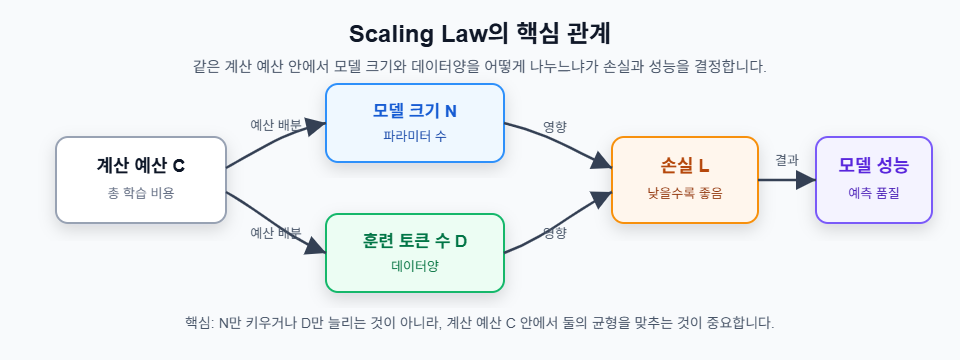

# 4교시: LLM의 황금률 - Scaling Laws

## 학습 목표
- Scaling Law의 핵심 개념을 이해한다
- Kaplan Scaling Law와 Chinchilla Scaling Law의 차이를 파악한다
- 제한된 예산에서 최적의 모델 크기와 데이터양을 계산한다
- 실습 코드에서 계산되는 \(N\), \(D\), \(C\), 손실값의 의미를 해석한다

---

### 1. Scaling Laws란 무엇인가?

#### 정의
> 모델 성능, 즉 손실 \(L\)이 모델 파라미터 수 \(N\), 훈련 토큰 수 \(D\), 계산량 \(C\)에 따라 어떻게 변하는지 설명하는 경험적 관계식

Scaling Law는 "모델을 무조건 크게 만들면 된다"가 아니라, **모델 크기와 데이터양을 같은 계산 예산 안에서 어떻게 나눌 것인가**를 알려주는 기준입니다.

#### 핵심 변수

| 기호 | 의미 | 실무적 해석 |
|---|---|---|
| L | Loss, 손실 | 낮을수록 모델 예측이 좋음 |
| N | Number of parameters | 모델 파라미터 수 |
| D | Dataset tokens | 훈련에 사용한 토큰 수 |
| C | Compute budget | 학습에 투입 가능한 총 계산량 |

#### 왜 중요한가?

| 잘못된 접근 | 문제 |
|---|---|
| 모델만 크게 만든다 | 데이터가 부족하면 비효율적이며 과적합 위험이 커진다 |
| 데이터만 늘린다 | 모델이 너무 작으면 데이터를 충분히 흡수하지 못한다 |
| 예산 없이 감으로 정한다 | 같은 비용으로 더 낮은 손실을 얻을 기회를 놓친다 |

| 올바른 접근 | 이유 |
|---|---|
| 같은 예산에서 N과 D를 균형 있게 정한다 | Scaling Law가 손실을 낮추는 효율적인 비율을 제안한다 |

#### 직관적 비유
Scaling Law는 LLM 학습의 **예산 배분표**입니다. 모델은 "엔진", 데이터는 "연료", 계산량은 "총 예산"에 가깝습니다. 큰 엔진만 사고 연료를 적게 넣으면 멀리 못 가고, 연료만 많고 엔진이 작아도 속도가 나지 않습니다.

---

### 2. Kaplan Scaling Law (OpenAI, 2020)

#### 수식

$$
L(N, D) = a \cdot N^{-\alpha} + b \cdot D^{-\beta} + c
$$

여기서 \(a\), \(b\), \(c\)는 실험적으로 맞추는 상수이고, \(\alpha\), \(\beta\)는 모델 크기와 데이터양이 손실 감소에 얼마나 영향을 주는지 나타내는 지수입니다.

전체 손실은 모델 크기 \(N\)과 데이터양 \(D\)가 함께 결정합니다. 다만 직관을 위해 한쪽 변수만 따로 보면 다음처럼 해석할 수 있습니다.

$$
\text{모델 크기 효과} \propto N^{-0.07}
$$

$$
\text{데이터양 효과} \propto D^{-0.16}
$$

즉, 아래 두 식은 전체 손실 함수가 아니라 **각 요소가 손실을 줄이는 방향을 설명하는 단순화된 표현**입니다.

#### 해석

| 변화 | 직관적 의미 |
|---|---|
| N을 2배 증가 | 모델 용량이 커져 손실이 줄어든다 |
| N을 10배 증가 | 손실이 더 줄지만, 증가량 대비 효과는 점점 작아진다 |
| D를 2배 증가 | 더 많은 학습 사례를 보므로 일반화에 도움이 된다 |
| D를 10배 증가 | 데이터 부족으로 생기는 비효율을 크게 줄일 수 있다 |

Kaplan 관점에서는 큰 모델을 학습시키는 것이 매우 중요하게 해석되었습니다. 하지만 이후 Chinchilla 연구는 "모델을 크게 하는 것만큼 데이터도 충분히 많이 줘야 한다"는 점을 더 강하게 보여주었습니다.

#### 계산량 근사

Transformer 계열 언어 모델의 학습 계산량은 거칠게 다음처럼 근사합니다.

$$
C \approx 6ND
$$

- \(N\): 모델 파라미터 수
- \(D\): 훈련 토큰 수
- \(6\): forward/backward 계산을 포함한 경험적 근사 계수

이 식은 정확한 하드웨어 비용 계산식이 아니라, **모델 크기와 데이터양이 모두 커질수록 계산량이 곱셈으로 증가한다**는 점을 보여주는 용도입니다.

#### Kaplan의 권장 방향

일정한 계산 예산 \(C\)가 있을 때 Kaplan식 직관은 모델 크기와 데이터양을 모두 늘리되, 상대적으로 큰 모델의 중요성을 강하게 보았습니다.

$$
N \propto C^{1/2}
$$

$$
D \propto C^{1/2}
$$

실습에서는 이 관점을 단순화하여 \(N\)과 \(D\)를 비슷한 규모로 배분하는 방식으로 계산합니다.

---

### 3. Chinchilla Scaling Law (DeepMind, 2022)

#### 수식

$$
L(N, D) = E + \frac{A}{N^\alpha} + \frac{B}{D^\beta}
$$

이 수식은 손실 \(L\)이 세 부분으로 구성된다고 봅니다.

| 항 | 의미 |
|---|---|
| E | 줄일 수 없는 기본 손실 |
| 모델 크기 항 | 모델이 작아서 생기는 손실 |
| 데이터양 항 | 데이터가 부족해서 생기는 손실 |

모델 크기 항은 다음과 같습니다.

$$
\frac{A}{N^\alpha}
$$

데이터양 항은 다음과 같습니다.

$$
\frac{B}{D^\beta}
$$

모델을 키우면 모델 크기 항이 줄고, 데이터를 늘리면 데이터양 항이 줄어듭니다. 핵심은 둘 중 하나만 줄이는 것이 아니라, **같은 계산량에서 두 항을 균형 있게 줄이는 것**입니다.

#### 주요 발견

| 항목 | GPT-3식 큰 모델 접근 | Chinchilla 접근 |
|---|---:|---:|
| 파라미터 수 | 약 1,750억 개 | 약 700억 개 |
| 훈련 토큰 수 | 약 3,000억 개 | 약 1조 4,000억 개 |
| D/N 비율 | 약 1.7배 | 약 20배 |
| 해석 | 모델은 크지만 데이터가 상대적으로 부족 | 모델은 작아도 데이터를 충분히 학습 |

Chinchilla의 핵심 결론은 다음과 같습니다.

$$
D \approx 20N
$$

즉, 파라미터가 \(N\)개라면 훈련 토큰은 대략 \(20N\)개가 되도록 잡는 것이 계산 효율적이라는 뜻입니다.

#### 실습 코드 변수 해석

실습에서 `N`, `D`, `C`는 텐서라기보다 스칼라 값입니다. 하지만 모델 설계 관점에서는 다음 의미를 가집니다.

| 코드 변수 | 수학 기호 | 예시 값 | 의미 |
|---|---|---:|---|
| `model_size` | N | `7.0e+10` | 700억 파라미터 |
| `data_tokens` | D | `1.4e+12` | 1조 4,000억 토큰 |
| `compute_budget` | C | `6*N*D` | 학습 계산량 근사 |
| `loss` | L | 실습 계산값 | 낮을수록 좋은 예측 성능 |

---

### 4. Kaplan vs Chinchilla를 직관적으로 비교하기

#### 같은 계산 예산이 있을 때

| 선택지 | 모델 크기 | 데이터양 | 기대되는 문제 |
|---|---:|---:|---|
| 모델을 크게 키움 | 큼 | 부족할 수 있음 | 데이터 부족, 비효율 |
| 데이터를 많이 줌 | 너무 작을 수 있음 | 큼 | 모델 용량 부족 |
| Chinchilla식 균형 | 적정 | 적정 | 계산 예산을 더 효율적으로 사용 |

#### 시나리오

예산이 100 GPU-일이라고 가정합니다.

| 옵션 | 모델 크기 | 토큰 수 | 해석 |
|---|---:|---:|---|
| A: 큰 모델 | 1B 파라미터 | 5B 토큰 | 모델은 크지만 데이터가 부족할 수 있음 |
| B: 균형 모델 | 300M 파라미터 | 6B 토큰 | D가 N의 약 20배인 설정 |

일반적으로 옵션 B처럼 모델 크기와 데이터량의 비율을 맞추는 방식이 같은 예산에서 더 안정적입니다.

---

### 5. 실습과 실제 모델로 확인하기

#### 이론과 실습의 연결

이번 교안의 핵심 개념은 `04_ScalingLaws/실습.ipynb`에서 다음 흐름으로 확인합니다.

| 교안 개념 | 실습 매핑 |
|---|---|
| Kaplan Scaling Law | Kaplan 계수 초기화 및 손실 계산 |
| Chinchilla Scaling Law | D = 20N 비율 기반 모델/데이터 계산 |
| 계산량 근사식 | 예산별 N, D 산출 |
| Kaplan vs Chinchilla 비교 | 표와 그래프 출력 |
| 실제 LLM 분석 | GPT-2, GPT-3, Chinchilla, LLaMA 계열의 D/N 비교 |

#### 실제 LLM 사례

실습 마지막 파트는 실제 공개 LLM 사례를 사용해 D/N 비율을 검증합니다.

| 모델 | 파라미터 N | 토큰 D | D/N |
|---|---:|---:|---:|
| GPT-2 | `1.5e+9` | `4.0e+10` | 26.7배 |
| GPT-3 | `1.75e+11` | `3.0e+11` | 1.7배 |
| Chinchilla | `7.0e+10` | `1.4e+12` | 20.0배 |
| LLaMA-65B | `6.5e+10` | `1.4e+12` | 21.5배 |

#### 실습 출력 표기 읽는 법

실습 출력에서 자주 보이는 표기법은 다음처럼 해석합니다.

| 출력 기호 | 의미 | 읽는 법 |
|---|---|---|
| `1.75e+11` | 1.75 곱하기 10의 11제곱 | 1,750억 |
| `1.40e+12` | 1.40 곱하기 10의 12제곱 | 1조 4,000억 |
| `20.0x` | D/N = 20 | 파라미터 1개당 토큰 20개 |
| `loss` | L | 낮을수록 좋음 |
| `-1.4%` | 비교 기준 대비 차이 | 실습의 단순화된 가정에서 나온 상대 차이 |

#### 실패 사례로 이해하기

Scaling Law를 잘못 적용하면 다음 문제가 생깁니다.

| 실패 사례 | 원인 | 결과 |
|---|---|---|
| N만 크게 함 | 데이터 D 부족 | 학습 효율 저하, 과적합 위험 |
| D만 크게 함 | 모델 N 부족 | 데이터의 패턴을 충분히 흡수하지 못함 |
| C를 과소평가 | 실제 하드웨어 효율 무시 | 학습 시간과 비용 초과 |
| 데이터 품질 무시 | 낮은 품질의 토큰 증가 | 토큰 수는 많지만 성능 향상 제한 |

---