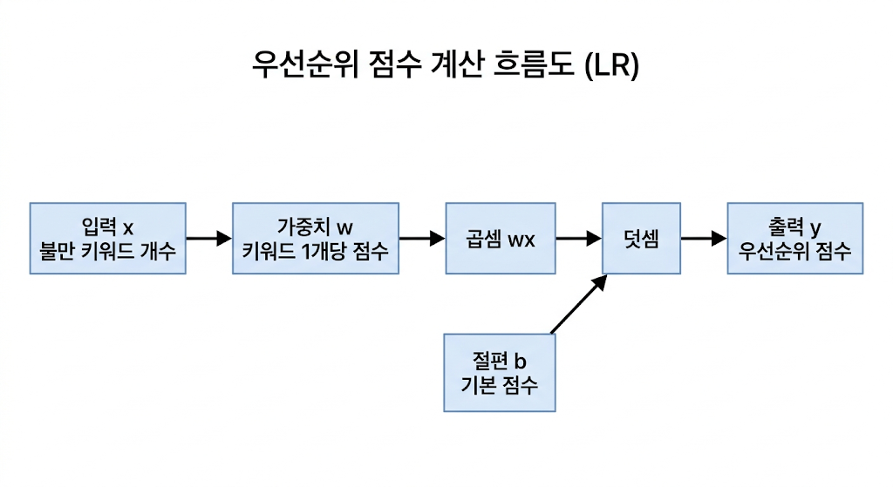

## [이론] 분류(Classification)의 핵심 알고리즘과 수식
분류는 입력 X가 여러 클래스 C 중 어디에 속하는지 결정하는 문제입니다.  
실무 예시로, 고객 문의를 "환불/배송/기타"로 자동 분류하면 상담 라우팅 시간이 크게 줄어듭니다.

핵심 분류기 2개를 다룹니다.

1) Naive Bayes
- 수식: P(C|X) = [P(X|C) * P(C)] / P(X)
- 변수 의미:
  - P(C|X): 관측 X가 주어졌을 때 클래스 C일 사후확률
  - P(X|C): 클래스 C일 때 X가 관측될 우도
  - P(C): 클래스 C의 사전확률
  - P(X): 증거(정규화 상수)

2) k-NN
- 거리 수식: d(p, q) = sqrt(Σ(p_i - q_i)^2)
- 변수 의미:
  - p, q: 두 샘플 벡터
  - p_i, q_i: i번째 특성값
  - k: 이웃 개수

분류 개념 연결(결정 점수 관점):
- y = wx + b (또는 z = w^T x + b) 형태의 점수 함수를 생각하면,
  w는 특성 중요도, b는 기준선(절편) 역할을 하며 최종 클래스 경계를 이동시킵니다.

## [풀이] 수식에 담긴 직관적인 의미
이 파트는 코드 없이, 실제 예시로 먼저 이해하는 구간입니다.
순서는 "상황 이야기 -> 수식 대입 -> 손계산 검증 -> 분류 결론"입니다.

### A) y = wx + b (결정 점수의 기본 틀)
- 수식 설명:
  - x: 입력 특성
  - w: 특성의 영향력(기울기)
  - b: 기준선 이동값(절편)
  - y: 최종 점수

- 텍스트 풀이:
  - 카페 쿠폰 비유로 보면, x는 "주문 횟수", w는 "주문 1회당 적립 포인트", b는 "가입 보너스/패널티"입니다.
  - 즉 y는 최종 포인트입니다. 같은 주문 횟수라도 w가 크면 포인트가 더 빨리 쌓이고, b가 크면 시작점 자체가 달라집니다.

- 데이터 검증:
  - 가정: w=2, b=-1, x=3
  - 계산: y = wx + b = 2*3 + (-1) = 5
  - 해석: 주문이 1회 늘 때마다 포인트가 2점씩 증가하고, 시작할 때 1점 페널티가 반영된 상태입니다.

- 실제 미니 예시:
  - 이벤트 팀이 "상담 우선순위 점수"를 y=wx+b로 계산한다고 가정합니다.
  - x=고객 불만 키워드 개수, w=3, b=1이면,
    - 키워드 0개 고객: y=3*0+1=1
    - 키워드 2개 고객: y=3*2+1=7
  - 결론: 키워드가 많은 고객이 더 높은 점수를 받아 우선 응대 대상이 됩니다.




- 한눈에 보는 표:

| 고객 | x(키워드 수) | 계산식 | 점수 y |
|---|---:|---|---:|
| A | 0 | 3×0+1 | 1 |
| B | 2 | 3×2+1 | 7 |

- 해석 그림:
  - A는 점수가 낮아 일반 처리
  - B는 점수가 높아 먼저 처리

### B) Naive Bayes: P(C|X) = [P(X|C) * P(C)] / P(X)
- 수식 설명:
  - P(C|X): X를 봤을 때 C일 확률(우리가 궁금한 값)
  - P(X|C): C라고 가정했을 때 X가 나올 가능성
  - P(C): C가 원래 얼마나 자주 나오는가
  - P(X): 정규화용 공통 분모

- 텍스트 풀이:
  - 탐정 비유로 보면, C는 "용의자", X는 "증거"입니다.
  - P(X|C)는 "이 용의자라면 이런 증거가 나올 가능성", P(C)는 "원래 용의자일 가능성"입니다.
  - 결국 탐정은 각 용의자 점수 P(X|C)*P(C)를 비교해 가장 큰 쪽을 고릅니다.
  - P(X)는 모든 용의자에서 공통 분모라, 누가 더 큰지 순위 비교에는 영향을 주지 않습니다.

- 데이터 검증(직접 계산):
  - 클래스: Spam, Ham
  - 사전확률: P(Spam)=0.4, P(Ham)=0.6
  - 증거 X=(free, urgent)
  - 우도: P(X|Spam)=0.7*0.6=0.42, P(X|Ham)=0.2*0.1=0.02
  - 비교 점수:
    - Spam: 0.42*0.4 = 0.168
    - Ham: 0.02*0.6 = 0.012
  - 결론: 0.168 > 0.012 이므로 Spam으로 분류

- 실제 스토리 예시(코드 없이 판단):
  - 상황: 고객 메일을 "광고성" vs "일반 문의"로 분류해야 합니다.
  - 과거 데이터 개수: 총 1000개 메일(광고 400개, 일반 600개)
  - 새 메일의 증거 X: "무료", "긴급" 두 단어 포함
  - 데이터팀이 과거 로그에서 추정한 값:
    - P(광고)=0.4, P(일반)=0.6
    - P(무료|광고)=0.7, P(긴급|광고)=0.6
    - P(무료|일반)=0.2, P(긴급|일반)=0.1
  - 손계산:
    - 광고 점수 = 0.7*0.6*0.4 = 0.168
    - 일반 점수 = 0.2*0.1*0.6 = 0.012
  - 결론: 광고 점수가 훨씬 크므로 "광고성"으로 분류
  - 포인트: 모델은 "느낌"이 아니라 확률 곱셈 결과로 결정을 내립니다.
  - 한 줄 요약: 1000개 중 광고 400개/일반 600개라는 "개수 정보"가 P(C)에 반영되고, 단어 등장 비율이 P(X|C)에 반영되어 최종 선택이 결정됩니다.

- 시각화:
```mermaid
flowchart LR
    D[메일 1000개] --> P1[광고 400개\nP(광고)=0.4]
    D --> P2[일반 600개\nP(일반)=0.6]
    P1 --> L1["무료"·"긴급" 등장 비율]
    P2 --> L2["무료"·"긴급" 등장 비율]
    L1 --> S1[점수 0.7×0.6×0.4 = 0.168]
    L2 --> S2[점수 0.2×0.1×0.6 = 0.012]
    S1 --> C[더 큰 점수 선택\n광고성]
    S2 --> C
```

- 한눈에 보는 표:

| 클래스 | 개수 | 사전확률 P(C) | 우도 P(X|C) | 최종 점수 |
|---|---:|---:|---:|---:|
| 광고 | 400 | 0.4 | 0.42 | 0.168 |
| 일반 | 600 | 0.6 | 0.02 | 0.012 |

- 해석 그림:
  - 400개 중에서 관측 패턴이 많이 맞는 쪽이 광고
  - 600개 중이더라도 증거가 약하면 최종 점수는 낮아짐

### C) k-NN 거리: d(p, q) = sqrt(Σ(p_i - q_i)^2)
- 수식 설명:
  - p_i - q_i: 각 축에서의 차이
  - (p_i - q_i)^2: 부호를 없애고 큰 차이에 페널티
  - Σ: 모든 축 차이 누적
  - sqrt: 제곱 스케일을 원래 거리 스케일로 복원

- 텍스트 풀이:
  - 동네 추천 비유로 보면, query는 "새 이웃", train 데이터는 "기존 주민"입니다.
  - 관심사/연령 같은 좌표가 비슷할수록 거리 d가 작아집니다.
  - 가장 가까운 k명의 취향(라벨)을 다수결로 모아 새 이웃의 취향 그룹을 정합니다.

- 데이터 검증(2차원):
  - query=(3,2), k=3
  - 학습 샘플:
    - A=(1,1), 라벨0 -> d=sqrt((3-1)^2 + (2-1)^2)=sqrt(5)=2.236
    - B=(2,1), 라벨0 -> d=sqrt((3-2)^2 + (2-1)^2)=sqrt(2)=1.414
    - C=(4,4), 라벨1 -> d=sqrt((3-4)^2 + (2-4)^2)=sqrt(5)=2.236
    - D=(5,4), 라벨1 -> d=sqrt((3-5)^2 + (2-4)^2)=sqrt(8)=2.828
  - 가까운 3개: B(0), A(0), C(1)
  - 다수결: 라벨0이 2표 -> 최종 예측은 0
  - 해석: 새 이웃은 라벨0 주민들과 더 가까워 같은 그룹으로 분류됩니다.

- 실제 스토리 예시(코드 없이 판단):
  - 상황: 신규 고객을 "가벼운 사용자(0)" 또는 "헤비 사용자(1)"로 구분합니다.
  - 좌표 의미:
    - 첫째 축: 주간 접속일수
    - 둘째 축: 평균 세션 길이(단위 정규화)
  - 신규 고객 query=(3,2), k=3
  - 후보 고객 수: 전체 10명이 있다고 가정하고, 거리 계산 후 가장 가까운 3명만 선택합니다.
  - 선택된 3명의 라벨이 [0, 0, 1]이라면 0이 2표, 1이 1표입니다.
  - 결론: 신규 고객은 "가벼운 사용자(0)" 그룹으로 판단
  - 포인트: k-NN은 "전체 후보 N명 중에서 가까운 k명만 골라 다수결"로 결정합니다.


- 한눈에 보는 표:

| 후보 | 좌표 | 거리 | 라벨 |
|---|---|---:|---:|
| B | (2,1) | 1.414 | 0 |
| A | (1,1) | 2.236 | 0 |
| C | (4,4) | 2.236 | 1 |
| D | (5,4) | 2.828 | 1 |

- 해석 그림:
  - 가장 가까운 3명은 B, A, C
  - 라벨 0이 2표이므로 새 고객은 0

실무적으로는:
- Naive Bayes: 텍스트 분류(스팸/정상)처럼 고차원 희소 데이터에서 빠르고 강함
- k-NN: 데이터 분포가 복잡해도 모델 학습 없이 직관적으로 동작하지만, 예측 시 계산량이 큼

## [실습] 코드로 증명하기 (Student Hands-on)
### 실습 원칙
- 반드시 "수식을 텍스트로 먼저 계산"한 뒤 코드를 실행합니다.
- 코드 출력이 방금 손계산한 값과 일치하면, 수식을 코드로 증명한 것입니다.
- 즉, 지금부터의 코드는 "이미 끝낸 수식 풀이"를 재현하는 검산 단계입니다.

### 0) 가상환경 활성화 (Windows)
```bash
conda activate paper_env
paper_env\Scripts\python.exe --version
```

### 1) Naive Bayes를 수식대로 직접 구현
```python

from math import prod

classes = ["Spam", "Ham"]
prior = {"Spam": 0.4, "Ham": 0.6}
likelihood = {
    "Spam": {"free": 0.7, "urgent": 0.6},
    "Ham": {"free": 0.2, "urgent": 0.1},
}
X = ["free", "urgent"]

scores = {}
for c in classes:
    #### [ 빈칸: 이 부분을 직접 코딩하세요 ]
    # 목표: 텍스트 풀이에서 계산한 P(X|C)*P(C)를 코드로 재현
    px_given_c = prod([likelihood[c][token] for token in X])
    scores[c] = px_given_c * prior[c]

pred = max(scores, key=scores.get)
print("NB scores:", scores)
print("NB prediction:", pred)
```

### 2) k-NN을 수식대로 직접 구현
```python

from math import sqrt
from collections import Counter

train_X = [[1, 1], [2, 1], [4, 4], [5, 4]]
train_y = [0, 0, 1, 1]
query = [3, 2]
k = 3

def euclidean(p, q):
    #### [ 빈칸: 이 부분을 직접 코딩하세요 ]
    # 목표: 텍스트 풀이에서 계산한 sqrt(Σ(p_i - q_i)^2)를 코드로 재현
    

dists = [(euclidean(x, query), y) for x, y in zip(train_X, train_y)]
dists.sort(key=lambda t: t[0])
knn = [label for _, label in dists[:k]]
pred = Counter(knn).most_common(1)[0][0]

print("k-NN sorted distances:", dists)
print("k-NN neighbors:", knn)
print("k-NN prediction:", pred)
```

## [결과] 이 알고리즘의 한계와 실무 적용 포인트
- Naive Bayes 한계:
  - 특성 독립 가정이 강함(현실에서는 단어/특성 간 상관이 큼)
  - 확률값 보정(calibration)이 필요할 수 있음
- k-NN 한계:
  - 데이터가 커질수록 예측이 느려짐
  - 스케일 차이에 민감하므로 표준화가 사실상 필수

실무 적용 포인트:
- 빠른 베이스라인: Naive Bayes로 먼저 성능 기준선 확보
- 설명 가능한 프로토타입: k-NN으로 거리 기반 의사결정 검증
- 운영 전 체크리스트:
  - Naive Bayes는 클래스 불균형 시 prior 재점검
  - k-NN은 k 값/거리척도/스케일링을 교차검증으로 결정
