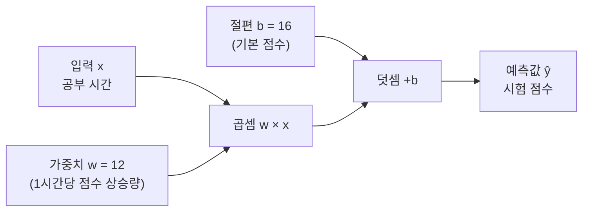
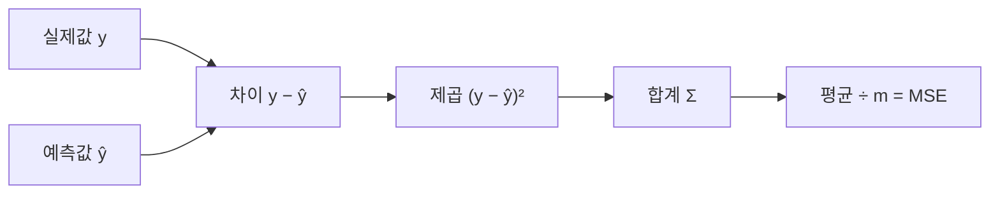
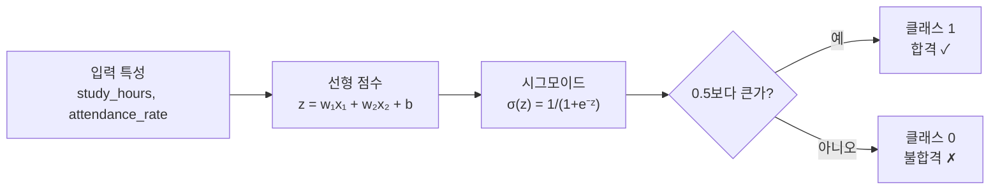

## [도입] 이 파트에서 배울 것

### 학습 목표
1. 연속 수치를 예측하는 **선형회귀**의 수식과 오차 계산 방식을 이해한다.
2. 예측 점수를 0/1 분류로 연결하는 **로지스틱 회귀**의 구조와 시그모이드 변환을 이해한다.
3. **동일한 데이터**를 손계산 → 코드로 재현하며 수식이 실제로 작동하는 것을 직접 확인한다.

### 공통 데이터셋: 학원 수강생 4명

> 이 표의 데이터는 **모든 손계산, 시각화, 실습 코드**에서 동일하게 사용됩니다.
> 숫자를 따라가며 수식이 어디서 나왔는지 끊기지 않고 추적할 수 있습니다.

| 학생 | 공부 시간 `study_hours` | 출석률 `attendance_rate` | 실제 점수 `score` | 합격 여부 `pass` |
|:---:|---:|---:|---:|:---:|
| A | 1 | 0.4 | 28 | 0 (불합격) |
| B | 3 | 0.7 | 52 | 1 (합격) |
| C | 5 | 0.9 | 74 | 1 (합격) |
| D | 2 | 0.5 | 39 | 0 (불합격) |

**스토리라인:**
- **선형회귀** → 공부 시간을 보고 시험 점수(연속값)를 예측
- **로지스틱 회귀** → 공부 시간 + 출석률을 보고 합격/불합격(0/1)을 판정

---

## [이론 1] 선형회귀 — y = wx + b

회귀는 입력 X를 보고 **연속적인 수치 y를 예측**하는 문제입니다.
집값 예측, 매출 예측, 점수 예측처럼 결과가 숫자로 나오는 모든 문제가 해당됩니다.

핵심 질문:
- 입력이 커지면 출력도 함께 커지는가?
- 그 관계를 직선으로 먼저 설명할 수 있는가?

### 1-1) 핵심 수식

```
ŷ = w × x + b
```

#### 용어 정의

| 기호 | 이름 | 의미 | 사용 목적 |
|:---:|---|---|---|
| `x` | **입력 특성 (Feature)** | 모델에게 주는 정보 | 예측의 근거가 되는 값 |
| `w` | **가중치 (Weight)** | 입력 x가 출력에 미치는 영향력 | w가 클수록 그 특성이 예측에 더 중요함 |
| `b` | **절편 (Bias)** | x=0일 때의 기본 예측값 | 직선을 위아래로 이동시키는 보정값 |
| `ŷ` | **예측값 (Predicted Value)** | 모델이 계산한 결과 | 실제값 y와 구분하기 위해 `^(hat)` 기호를 씀 |

> **w와 b를 왜 배워야 하는가?**
> 머신러닝의 본질은 "데이터를 가장 잘 설명하는 w와 b를 찾는 것"입니다.
> 이 두 숫자만 잘 결정되면, 새 입력에 대해서도 예측값을 만들 수 있습니다.

### 1-2) 공통 데이터로 손계산

**설정:** 공부 시간(`study_hours`) 하나만 보고 점수를 예측합니다.
- 가중치 `w = 12` (공부 1시간 → 점수 12점 상승 예상)
- 절편 `b = 16` (아무것도 안 해도 기본 16점)

| 학생 | 공부 시간 x | 계산식 ŷ = 12×x + 16 | 예측 점수 ŷ | 실제 점수 y |
|:---:|---:|---|---:|---:|
| A | 1 | 12×1 + 16 | **28** | 28 |
| B | 3 | 12×3 + 16 | **52** | 52 |
| C | 5 | 12×5 + 16 | **76** | 74 |
| D | 2 | 12×2 + 16 | **40** | 39 |

> 학생 A, B는 예측이 정확히 맞았고 C, D는 약간 차이가 납니다.
> 이 차이(오차)를 어떻게 숫자로 표현하는지가 다음 이론의 핵심입니다.

### 1-3) 시각화



### 1-4) 직관 정리

- 직선의 기울기가 `w`: w가 클수록 입력 변화에 예측이 크게 반응합니다.
- 직선의 시작점이 `b`: 모든 학생의 기본 출발점입니다.
- 선형회귀는 이 두 값을 데이터에서 자동으로 찾아주는 알고리즘입니다.

✅ **다음 단계:** 예측이 얼마나 틀렸는지 숫자로 측정하는 방법(MSE)을 봅니다.

---

## [이론 2] MSE — 예측 오차를 숫자로 측정하기

### 2-1) 핵심 수식

```
MSE = (1/m) × Σ(y − ŷ)²
```

#### 용어 정의

| 기호 | 이름 | 의미 | 사용 목적 |
|:---:|---|---|---|
| `y` | **실제값 (True Value)** | 데이터에 실제로 기록된 정답 | 예측값과 비교하는 기준 |
| `ŷ` | **예측값 (Predicted Value)** | 모델이 계산한 값 | 실제값과의 차이를 측정 |
| `y − ŷ` | **오차 (Error)** | 예측이 얼마나 빗나갔는가 | 양수/음수 모두 가능 |
| `(y − ŷ)²` | **제곱 오차** | 오차를 제곱한 값 | 방향(부호)을 없애고, 큰 오차를 강하게 벌줌 |
| `m` | **샘플 수** | 데이터 개수 | 전체 합계를 평균으로 바꾸기 위해 나눔 |
| `Σ` | **합계 기호 (Sigma)** | 모든 샘플의 값을 더함 | 전체 오차를 하나의 숫자로 합산 |
| `MSE` | **평균 제곱 오차 (Mean Squared Error)** | 전체 예측 품질 지표 | 값이 작을수록 모델이 잘 맞음 |

> **왜 그냥 더하지 않고 제곱을 하는가?**
> - 오차 +5와 -5를 그냥 더하면 0이 되어 오차가 없는 것처럼 보입니다.
> - 제곱하면 두 오차 모두 25가 되어 "틀린 정도"를 올바르게 반영합니다.
> - 또한 오차가 10이면 제곱은 100이 되어, 큰 실수에 더 강한 벌점을 줍니다.

### 2-2) 공통 데이터로 손계산

앞 이론 1의 예측값(ŷ)과 실제값(y)의 차이를 계산합니다.

| 학생 | 실제값 y | 예측값 ŷ | 오차 (y − ŷ) | 제곱 오차 (y − ŷ)² |
|:---:|---:|---:|---:|---:|
| A | 28 | 28 | 0 | 0 |
| B | 52 | 52 | 0 | 0 |
| C | 74 | 76 | −2 | 4 |
| D | 39 | 40 | −1 | 1 |

```
MSE = (0 + 0 + 4 + 1) / 4 = 5 / 4 = 1.25
```

> **결론:** 이 모델의 평균 예측 오차는 약 ±1.25점 수준입니다. 꽤 잘 맞는 편입니다.

### 2-3) 시각화



### 2-4) 해석 포인트

- MSE = 0이면 모든 예측이 완벽히 맞은 것입니다.
- 학생 C, D만 틀렸지만 오차가 작아 전체 MSE는 낮습니다.
- 만약 한 샘플의 오차가 10이었다면 그 기여분만 100이 되어 MSE가 급등합니다.

✅ **다음 단계:** 입력을 한 개에서 여러 개로 확장하면 어떻게 되는지 봅니다.

---

## [이론 3] 선형회귀 확장 — 여러 특성 함께 사용하기

### 3-1) 핵심 개념

현실 데이터는 보통 하나의 특성만으로 설명되지 않습니다.
집값은 면적만이 아니라 층수, 역세권 거리, 연식도 함께 영향을 줍니다.

이때도 구조는 같습니다: **각 특성에 가중치를 곱해 더한 뒤, 절편을 더합니다.**

```
ŷ = w₁×x₁ + w₂×x₂ + ⋯ + b
```

| 기호 | 의미 |
|:---:|---|
| `x₁, x₂, ...` | 각각의 입력 특성 (여러 개) |
| `w₁, w₂, ...` | 각 특성의 가중치 (각각 독립적으로 결정됨) |
| `b` | 절편 (여전히 하나) |

> **w를 왜 특성마다 따로 두는가?**
> 면적 1m² 증가와 층수 1층 증가가 집값에 미치는 영향은 다릅니다.
> 각 w는 "이 특성이 예측에 얼마나 중요한가"를 독립적으로 나타냅니다.

### 3-2) 공통 데이터로 손계산 (2개 특성)

이번에는 `study_hours`와 `attendance_rate` 둘 다 사용합니다.
- `w₁ = 10` (공부 시간 가중치)
- `w₂ = 5` (출석률 가중치, 단위가 달라 별도 설정)
- `b = 15`

| 학생 | study_hours x₁ | attendance_rate x₂ | ŷ = 10×x₁ + 5×x₂ + 15 | 실제 점수 y |
|:---:|---:|---:|---:|---:|
| A | 1 | 0.4 | 10×1 + 5×0.4 + 15 = **27** | 28 |
| B | 3 | 0.7 | 10×3 + 5×0.7 + 15 = **48.5** | 52 |
| C | 5 | 0.9 | 10×5 + 5×0.9 + 15 = **69.5** | 74 |
| D | 2 | 0.5 | 10×2 + 5×0.5 + 15 = **37.5** | 39 |

> 단일 특성(MSE=1.25)보다 오차가 늘었습니다. 가중치 값이 최적화되지 않았기 때문입니다.
> 실제 머신러닝은 이 가중치를 데이터를 통해 자동으로 조정합니다(경사하강법).

### 3-3) 해석 포인트

- 단일 직선은 가장 단순한 시작입니다.
- 특성이 많아질수록 각 w의 의미를 함께 해석해야 합니다.
- 입력 단위가 다르면(시간 vs 비율) 가중치 크기를 직접 비교하기 어렵습니다.

✅ **다음 단계:** 이제 이 점수를 "합격/불합격"처럼 클래스 결정에 사용하는 로지스틱 회귀로 넘어갑니다.

---

## [이론 4] 로지스틱 회귀 — 점수를 확률로, 확률을 분류로

### 4-1) 왜 선형회귀로 분류할 수 없는가

선형회귀의 출력 ŷ는 범위가 없습니다: -100도, 0도, 500도 가능합니다.
그런데 분류는 "클래스 1일 확률"처럼 **0과 1 사이 값**이 필요합니다.

> **핵심 질문:** 점수 z = 76을 어떻게 "합격 확률 0.97"로 바꾸는가?

### 4-2) 시그모이드 함수

> **용어: 시그모이드 (Sigmoid)**
> 임의의 실수를 0~1 사이로 압축하는 S자 모양의 함수입니다.
> "얼마나 확신하는가"를 확률처럼 읽히는 값으로 변환하는 역할을 합니다.

```
σ(z) = 1 / (1 + e^(−z))
```

| 기호 | 이름 | 의미 |
|:---:|---|---|
| `z` | **raw score** | 시그모이드 적용 전 선형 계산 결과 (`wx + b`로 구한 값) |
| `e` | **자연상수 (≈2.718)** | 지수 함수의 밑수 |
| `σ(z)` | **시그모이드 출력** | 0~1 사이의 값, 클래스 1일 확률로 해석 |

> **용어: raw score (z)**
> 시그모이드를 거치기 전 선형식(`wx + b`)으로 계산된 원래 점수입니다.
> 범위에 제한이 없으며, 이 값을 시그모이드에 통과시켜 확률로 바꿉니다.

#### 시그모이드 곡선 한눈에 보기

| z (raw score) | σ(z) | 느낌 |
|---:|---:|---|
| −6 | 0.002 | 거의 0 → 클래스 0 확실 |
| −2 | 0.119 | 0 쪽으로 기욺 |
| 0 | 0.500 | 정확히 경계선 |
| 2 | 0.881 | 1 쪽으로 기욺 |
| 6 | 0.998 | 거의 1 → 클래스 1 확실 |

```text
σ(z)
1.0 |                               *********
0.8 |                         ******
0.6 |                    *****
0.5 |---------------*****-------------------
0.4 |            ***
0.2 |      ******
0.0 |*****
     +---------------------------------------- z
      -6      -2      0       2       6
```

**곡선이 중요한 이유:**
- z가 0 근처일 때: 작은 변화에도 σ(z)가 빠르게 바뀝니다 → 경계 근처는 민감
- z가 ±6처럼 극단적일 때: 이미 확실한 쪽이라 더 커져도 변화가 거의 없습니다
- 즉 시그모이드는 **가운데는 민감하고 양끝은 완만한 S자 곡선**입니다.

**비유:** 온도계처럼 생각하면 됩니다.
raw score z는 "뜨겁다/차갑다"를 숫자로 막 적은 상태이고,
시그모이드는 그 숫자를 0~1 사이 "확률 눈금"으로 바꿔주는 변환기입니다.

### 4-3) 분류 결정 흐름



### 4-4) 공통 데이터로 손계산

**설정값:**
- `w_study = 2`, `w_attendance = 1.5`, `b = −5`

| 학생 | study | attendance | z = 2×study + 1.5×attendance − 5 | σ(z) ≈ | 판정 | 실제 |
|:---:|---:|---:|---:|---:|:---:|:---:|
| A | 1 | 0.4 | 2×1 + 1.5×0.4 − 5 = **−2.4** | 0.083 | 0 (불합격) | 0 ✓ |
| B | 3 | 0.7 | 2×3 + 1.5×0.7 − 5 = **+2.05** | 0.886 | 1 (합격) | 1 ✓ |
| C | 5 | 0.9 | 2×5 + 1.5×0.9 − 5 = **+6.35** | 0.999 | 1 (합격) | 1 ✓ |
| D | 2 | 0.5 | 2×2 + 1.5×0.5 − 5 = **−0.25** | 0.438 | 0 (불합격) | 0 ✓ |

**4명 전원 올바르게 분류됩니다!**

> **해석:**
> - 학생 A(z=−2.4): 확률이 8.3%로 낮음 → 불합격 확실
> - 학생 D(z=−0.25): 확률이 43.8%로 경계선(0.5) 근처 → 불합격이지만 아슬아슬
> - 학생 B(z=+2.05): 확률이 88.6% → 합격 확실
> - 학생 C(z=+6.35): 확률이 99.9% → 합격 매우 확실

### 4-5) logit — 확률에서 점수로 되돌리기

> **용어: logit**
> 시그모이드의 역함수입니다.
> 0~1 사이의 확률 p를 받아 원래의 raw score z로 되돌려줍니다.
> "이 확률이 나오려면 내부 점수가 얼마였어야 했을까?"를 계산할 때 사용합니다.

```
logit(p) = ln(p / (1 − p))
```

| 기호 | 의미 |
|:---:|---|
| `p` | 0~1 사이 확률 |
| `ln` | 자연로그 |
| `logit(p)` | 해당 확률에 대응하는 raw score |

#### 왕복 구조 (앞뒤로 변환 가능)

```
점수 z  →  시그모이드 σ(z)  →  확률 p
확률 p  →  logit(p)        →  점수 z
```

| 예시 | 계산 | 결과 |
|---|---|---|
| z = 0 → p | σ(0) = 1/(1+1) | p = **0.5** |
| p = 0.5 → z | logit(0.5) = ln(1) | z = **0** |
| z = 2.05 → p | σ(2.05) ≈ 1/(1+e⁻²·⁰⁵) | p ≈ **0.886** |
| p = 0.886 → z | logit(0.886) = ln(0.886/0.114) | z ≈ **2.05** |

> **비유:** 시그모이드는 점수를 "확률 표"로 바꾸는 엘리베이터이고,
> logit은 그 확률 표를 다시 "원래 층수(점수)"로 되돌리는 복원 장치입니다.

### 4-6) 왜 이름이 "회귀"인데 분류에 쓰는가

- 내부 구조는 선형회귀와 동일합니다: z = wx + b
- 다만 최종 목표가 연속값이 아니라 **0/1 클래스 결정**입니다.
- 시그모이드로 확률의 형태를 거쳐 분류 결정이 이루어집니다.
- 즉 **"점수 계산(회귀 구조) + 확률 변환 + 분류 결정"** 의 3단계 구조입니다.

✅ **다음 단계:** 이 모든 계산을 코드로 재현하고, 손계산과 동일한 결과가 나오는지 확인합니다.

---

## [실습] 코드로 증명하기

### 실습 원칙
- 손계산에서 이미 확인한 숫자를 코드로 재현합니다.
- 같은 데이터, 같은 수식, 같은 결과가 나와야 합니다.
- 코드의 빈칸은 수식의 핵심 로직을 직접 채워 넣도록 설계합니다.

### Step 0) 환경 확인 (최초 1회만 실행)

```bash
# 가상환경 활성화 (Windows)
conda activate paper_env
paper_env\Scripts\python.exe --version
```

---

### Step 1) 공통 데이터셋 정의

> **이 코드가 하는 것:** 이론에서 사용한 학생 4명 데이터를 코드로 선언합니다.
> 이후 모든 Steps는 이 데이터를 그대로 사용합니다.

```python
# 공통 데이터셋 — 이론 파트와 완전히 동일한 데이터
students = ["A", "B", "C", "D"]
study_hours      = [1,  3,  5,  2]   # 공부 시간
attendance_rate  = [0.4, 0.7, 0.9, 0.5]   # 출석률
score_true       = [28, 52, 74, 39]   # 실제 시험 점수
pass_true        = [0,  1,  1,  0]    # 합격(1) / 불합격(0)

print("=== 공통 데이터셋 ===")
for i, name in enumerate(students):
    print(f"  학생 {name}: study={study_hours[i]}h, "
          f"attendance={attendance_rate[i]}, "
          f"score={score_true[i]}, pass={pass_true[i]}")
```

**예상 출력:**
```
=== 공통 데이터셋 ===
  학생 A: study=1h, attendance=0.4, score=28, pass=0
  학생 B: study=3h, attendance=0.7, score=52, pass=1
  학생 C: study=5h, attendance=0.9, score=74, pass=1
  학생 D: study=2h, attendance=0.5, score=39, pass=0
```

---

### Step 2) 선형회귀 직접 구현 — ŷ = wx + b

> **이 코드가 증명하는 것:** `ŷ = 12 × study_hours + 16` 수식이
> 이론 1 손계산 표(A:28, B:52, C:76, D:40)와 동일한 결과를 냄을 확인합니다.

```python
# 이론 1 파트에서 설정한 가중치와 절편
w = 12   # 가중치: 공부 1시간당 점수 상승량
b = 16   # 절편: 기본 점수

def linear_predict(x, w, b):
    """
    선형회귀 예측 함수
    y_hat = w * x + b
    """
    #### [ 빈칸: 이 부분을 완성하세요 — y = wx + b ]
    return w * x + b

print("=== Step 2: 선형회귀 예측 (단일 특성: study_hours) ===")
predictions = []
for i, name in enumerate(students):
    y_hat = linear_predict(study_hours[i], w, b)
    predictions.append(y_hat)
    print(f"  학생 {name}: ŷ = 12×{study_hours[i]} + 16 = {y_hat:>5}  (실제: {score_true[i]})")

# 손계산 검증: A=28, B=52, C=76, D=40 이 나와야 합니다
```

**예상 출력:**
```
=== Step 2: 선형회귀 예측 (단일 특성: study_hours) ===
  학생 A: ŷ = 12×1 + 16 =    28  (실제: 28)
  학생 B: ŷ = 12×3 + 16 =    52  (실제: 52)
  학생 C: ŷ = 12×5 + 16 =    76  (실제: 74)
  학생 D: ŷ = 12×2 + 16 =    40  (실제: 39)
```

---

### Step 3) MSE 직접 구현

> **이 코드가 증명하는 것:** 이론 2 손계산 MSE = 1.25가
> 코드로도 동일하게 계산됨을 확인합니다.

```python
def calc_mse(y_true_list, y_pred_list):
    """
    평균 제곱 오차(MSE) 계산
    MSE = (1/m) * Σ(y - ŷ)²
    """
    m = len(y_true_list)
    squared_errors = []
    for y, y_hat in zip(y_true_list, y_pred_list):
        #### [ 빈칸: 이 부분을 완성하세요 — (y - ŷ)² ]
        squared_errors.append((y - y_hat) ** 2)
    return sum(squared_errors) / m

print("\n=== Step 3: MSE 계산 ===")
for i, name in enumerate(students):
    err = score_true[i] - predictions[i]
    print(f"  학생 {name}: 오차={err:>3}, 제곱오차={err**2}")

mse = calc_mse(score_true, predictions)
print(f"\n  MSE = {mse}  ← 이론 2 손계산 결과와 동일해야 합니다 (기댓값: 1.25)")
```

**예상 출력:**
```
=== Step 3: MSE 계산 ===
  학생 A: 오차=  0, 제곱오차=0
  학생 B: 오차=  0, 제곱오차=0
  학생 C: 오차= -2, 제곱오차=4
  학생 D: 오차= -1, 제곱오차=1

  MSE = 1.25  ← 이론 2 손계산 결과와 동일해야 합니다 (기댓값: 1.25)
```

---

### Step 4) 로지스틱 회귀 — 시그모이드 분류

> **이 코드가 증명하는 것:** `z = 2×study + 1.5×attendance − 5` 수식으로
> 시그모이드를 거쳐 이론 4 손계산 판정표(A:0, B:1, C:1, D:0)와 동일하게 나옴을 확인합니다.

```python
import math

def sigmoid(z):
    """
    시그모이드 함수: 임의의 실수 z를 0~1 사이로 변환
    σ(z) = 1 / (1 + e^(-z))
    """
    #### [ 빈칸: 이 부분을 완성하세요 — 시그모이드 수식 ]
    return 1 / (1 + math.exp(-z))

def logistic_score(study, attendance, w_study, w_att, bias):
    """
    로지스틱 회귀의 raw score 계산
    z = w_study * study + w_att * attendance + bias
    """
    #### [ 빈칸: 이 부분을 완성하세요 — z = wx + b ]
    return w_study * study + w_att * attendance + bias

# 이론 4에서 설정한 가중치
w_study = 2.0
w_att   = 1.5
bias    = -5.0

print("\n=== Step 4: 로지스틱 회귀 분류 ===")
print(f"  설정: w_study={w_study}, w_attendance={w_att}, bias={bias}")
print(f"  {'학생':^4} | {'z(raw score)':>12} | {'σ(z)':>8} | {'예측':^10} | {'실제':^6} | {'일치':^4}")
print("  " + "-" * 60)

all_correct = True
for i, name in enumerate(students):
    z = logistic_score(study_hours[i], attendance_rate[i], w_study, w_att, bias)
    prob = sigmoid(z)
    predicted = 1 if prob >= 0.5 else 0
    correct = "✓" if predicted == pass_true[i] else "✗"
    if predicted != pass_true[i]:
        all_correct = False
    label_pred = "합격(1)" if predicted == 1 else "불합격(0)"
    label_true = "합격(1)" if pass_true[i] == 1 else "불합격(0)"
    print(f"  학생 {name}  | {z:>12.4f} | {prob:>8.3f} | {label_pred:^10} | {label_true:^8} | {correct:^4}")

print(f"\n  결론: {'4명 전원 올바르게 분류됨 ✓' if all_correct else '일치하지 않는 샘플 있음 ✗'}")
```

**예상 출력:**
```
=== Step 4: 로지스틱 회귀 분류 ===
  설정: w_study=2.0, w_attendance=1.5, bias=-5.0
  학생 |  z(raw score) |     σ(z) |    예측    |  실제  | 일치
  ------------------------------------------------------------
  학생 A  |      -2.4000 |    0.083 |  불합격(0) | 불합격(0)|  ✓
  학생 B  |       2.0500 |    0.886 |   합격(1)  |  합격(1) |  ✓
  학생 C  |       6.3500 |    0.999 |   합격(1)  |  합격(1) |  ✓
  학생 D  |      -0.2500 |    0.438 |  불합격(0) | 불합격(0)|  ✓

  결론: 4명 전원 올바르게 분류됨 ✓
```

---

### Step 5) 전체 흐름 한눈에 보기

> **이 코드가 하는 것:** 선형회귀(점수 예측)와 로지스틱 회귀(합격 판정)를
> 동일한 데이터로 나란히 출력해 전체 흐름을 확인합니다.

```python
print("\n" + "=" * 65)
print("=== Step 5: 선형회귀 + 로지스틱 회귀 전체 흐름 ===")
print("=" * 65)
print(f"  {'학생':^4} | {'예측점수(ŷ)':>10} | {'실제점수(y)':>10} | {'합격확률':>8} | {'최종판정':^10}")
print("  " + "-" * 58)

for i, name in enumerate(students):
    y_hat = linear_predict(study_hours[i], w=12, b=16)
    z     = logistic_score(study_hours[i], attendance_rate[i], w_study, w_att, bias)
    prob  = sigmoid(z)
    label = "합격 ✓" if prob >= 0.5 else "불합격 ✗"
    print(f"  학생 {name}  | {y_hat:>10} | {score_true[i]:>10} | {prob:>8.3f} | {label:^10}")

print("\n  [선형회귀]   → 공부 시간만 보고 점수(연속값) 예측")
print("  [로지스틱]   → 공부 시간 + 출석률 보고 합격 여부(0/1) 판정")
print("  [공통 구조]  → 둘 다 'z = wx + b' 에서 출발합니다")
```

---

## [결과] 두 알고리즘 비교와 실무 적용

### 모델 비교표

| 구분 | 선형회귀 | 로지스틱 회귀 |
|---|---|---|
| **출력 형태** | 연속값 (예: 74점, 3.2억원) | 확률 → 클래스 (예: 합격/불합격) |
| **핵심 수식** | ŷ = wx + b | σ(wx + b) ≥ 0.5 → 클래스 1 |
| **오차 측정** | MSE (평균 제곱 오차) | Binary Cross-Entropy (이진 교차 엔트로피) |
| **주요 사용처** | 점수 예측, 집값, 매출 예측 | 스팸 분류, 이탈 예측, 합격/불합격 |
| **경계 유형** | 수치 범위 예측 | 결정 경계 (0.5 기준) |
| **핵심 약점** | 비선형 관계에 취약 | 복잡한 결정 경계 표현 불가 |

### 실무 선택 가이드

| 상황 | 추천 모델 | 이유 |
|---|---|---|
| 결과가 숫자 범위로 나와야 함 | **선형회귀** | 연속값 예측이 목적 |
| 결과가 "예/아니오" 형태 | **로지스틱 회귀** | 이진 분류의 기준선 모델 |
| 특성이 여러 개 | **다중 선형/로지스틱** | 구조는 같고 입력만 확장 |
| 더 복잡한 경계가 필요 | 의사결정트리, SVM, 신경망 | 로지스틱은 기준선으로 활용 |

### 한계점 정리

- **선형회귀:** 관계가 직선이 아닐 때 성능이 떨어집니다. 이상치에 민감합니다.
- **MSE:** 큰 오차를 강하게 벌주므로, 이상치가 있으면 점수가 급격히 나빠집니다.
- **선형회귀 확장:** 특성이 많아질수록 각 w의 의미 해석이 어려워지고, 단위가 다르면 가중치 크기를 직접 비교하기 어렵습니다.
- **로지스틱 회귀:** 단순 직선 경계만 표현 가능합니다. 복잡한 패턴에는 부족하지만 해석 가능한 기준선 모델로는 매우 유용합니다.

### 실무 적용 포인트

1. **연속값 예측 → 선형회귀부터 시작**, MSE로 기준 성능 확인
2. **여러 특성이 있으면 다중 선형회귀**로 확장, 각 w의 상대적 크기를 해석
3. **클래스 구분 문제 → 로지스틱 회귀로 기준선** 만든 뒤 다른 모델과 비교
4. **경계 근처 샘플(σ(z) ≈ 0.5)**은 판정이 불안정할 수 있으므로 추가 검토 필요
