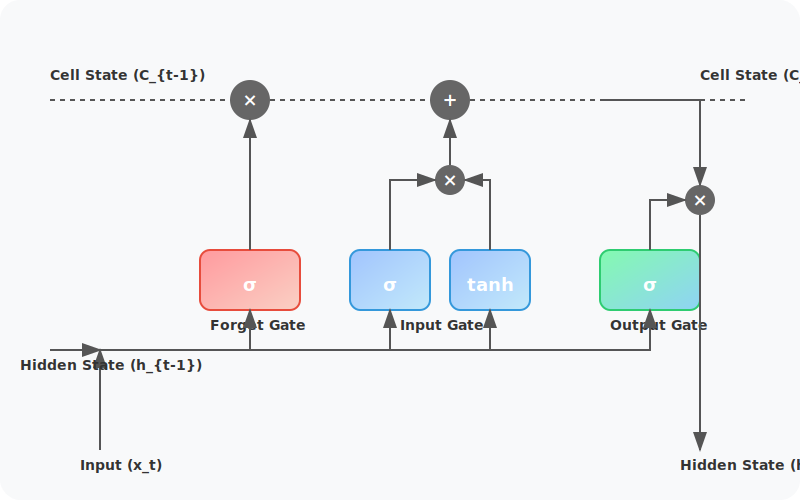

#  LSTM(Long Short-Term Memory) 단계별 알고리즘 가이드

---

## 1. 아키텍처 개요

LSTM은 정보를 오랫동안 보존하기 위해 **Cell State ($C_t$)** 라는 통로를 두고, 이를 세 개의 게이트(Gate)로 관리합니다.



---

## 2. 실험용 샘플 데이터 설정
각 단계의 계산 과정을 증명하기 위해 다음과 같은 샘플 데이터를 가정합니다. (계산의 편의를 위해 편향 $b$는 0으로 가정합니다.)

*   **입력 ($x_t$):** `1.0` (현재 시점의 정보)
*   **이전 은닉 상태 ($h_{t-1}$):** `0.5` (직전 시점의 요약 정보)
*   **이전 셀 상태 ($C_{t-1}$):** `0.8` (과거부터 내려온 장기 기억)
*   **가중치 ($W$):** 모든 게이트 가중치를 `0.5`로 가정

---

## 3. 단계별 수식 증명 및 계산 과정

### 1단계: 망각 게이트 (Forget Gate) - "무엇을 지울까?"
과거의 정보($C_{t-1}$) 중에서 버릴 것과 남길 것을 결정합니다.

*   **수식:** $f_t = \sigma(W_f \cdot [h_{t-1}, x_t] + b_f)$
*   **용어 정의:**
    *   $f_t$: 망각 계수 (0~1 사이의 값. 0에 가까울수록 많이 삭제)
    *   $\sigma$: 시그모이드 활성화 함수 ($\frac{1}{1+e^{-x}}$)
*   **계산 과정:**
    1.  선형 연산: $0.5 \times (h_{t-1} + x_t) = 0.5 \times (0.5 + 1.0) = 0.75$
    2.  활성화: $\sigma(0.75) \approx 0.68$
*   **의미:** 과거 정보의 약 **68%** 를 유지하고 32%를 삭제합니다.

---

### 2단계: 입력 게이트 (Input Gate) - "새로운 정보를 어떻게 적을까?"
현재의 새로운 정보($x_t$)를 셀 상태에 얼마나 반영할지 결정합니다.

*   **수식:** 
    1.  $i_t = \sigma(W_i \cdot [h_{t-1}, x_t] + b_i)$
    2.  $\tilde{C}_t = \tanh(W_C \cdot [h_{t-1}, x_t] + b_C)$
*   **용어 정의:**
    *   $i_t$: 입력 계수 (새 정보의 중요도)
    *   $\tilde{C}_t$: 새로운 셀 상태 후보 (저장할 구체적인 내용)
*   **계산 과정:**
    1.  $i_t = \sigma(0.75) \approx 0.68$ (새 정보가 꽤 중요함)
    2.  $\tilde{C}_t = \tanh(0.75) \approx 0.63$ (저장할 실제 값)
*   **의미:** 새로운 정보($0.63$)를 **68%** 비중으로 반영할 준비를 합니다.

---

### 3단계: 셀 상태 업데이트 (Cell State Update) - "기억 갱신"
지우기로 한 과거 정보와 추가하기로 한 새 정보를 합쳐 새로운 장기 기억($C_t$)을 만듭니다.

*   **수식:** $C_t = f_t * C_{t-1} + i_t * \tilde{C}_t$
*   **계산 과정:**
    1.  과거 기억 보존: $0.68 \times 0.8 = 0.544$
    2.  새 기억 추가: $0.68 \times 0.63 = 0.4284$
    3.  최종 결과: $C_t = 0.544 + 0.4284 = \mathbf{0.9724}$
*   **의미:** 장기 기억이 기존 `0.8`에서 `0.9724`로 업데이트되었습니다.

---

### 4단계: 출력 게이트 (Output Gate) - "최종 출력 결정"
갱신된 셀 상태를 바탕으로 밖으로 내보낼 정보($h_t$)를 결정합니다.

*   **수식:**
    1.  $o_t = \sigma(W_o \cdot [h_{t-1}, x_t] + b_o)$
    2.  $h_t = o_t * \tanh(C_t)$
*   **용어 정의:**
    *   $o_t$: 출력 계수 (어떤 부분을 밖으로 알릴지 결정)
    *   $h_t$: 현재 은닉 상태 (다음 시점으로 전달될 요약본)
*   **계산 과정:**
    1.  $o_t = \sigma(0.75) \approx 0.68$
    2.  $h_t = 0.68 \times \tanh(0.9724) \approx 0.68 \times 0.75 \approx \mathbf{0.51}$
*   **의미:** 최종적으로 다음 단계에 전달할 단기 기억은 `0.51`입니다.

---

## 4. PyTorch 코드 적용

위에서 유도한 계산 로직은 PyTorch의 `nn.LSTM` 레이어 내부에서 행렬 연산으로 빠르게 수행됩니다.

```python
import torch
import torch.nn as nn

# 1. 모델 설정 (입력 차원 1, 은닉 차원 1)
lstm = nn.LSTM(input_size=1, hidden_size=1, batch_first=True)

# 2. 가중치 수동 설정 (실험과 동일하게 0.5로 설정)
with torch.no_grad():
    lstm.weight_ih_l0.fill_(0.5)
    lstm.weight_hh_l0.fill_(0.5)
    lstm.bias_ih_l0.fill_(0.0)
    lstm.bias_hh_l0.fill_(0.0)

# 3. 입력 데이터 준비 (x_t=1.0, h_t-1=0.5, c_t-1=0.8)
x_t = torch.tensor([[[1.0]]]) # (batch, seq, feature)
h_0 = torch.tensor([[[0.5]]]) # (num_layers, batch, hidden)
c_0 = torch.tensor([[[0.8]]]) # (num_layers, batch, hidden)

# 4. 계산 수행
output, (h_t, c_t) = lstm(x_t, (h_0, c_0))

print(f"업데이트된 Cell State (C_t): {c_t.item():.4f}")
print(f"업데이트된 Hidden State (h_t): {h_t.item():.4f}")
```

---
