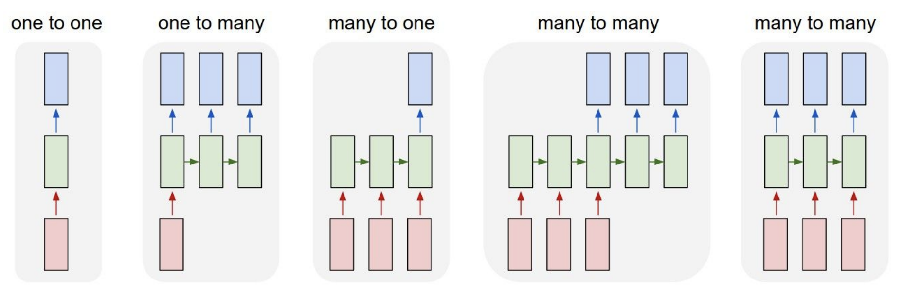
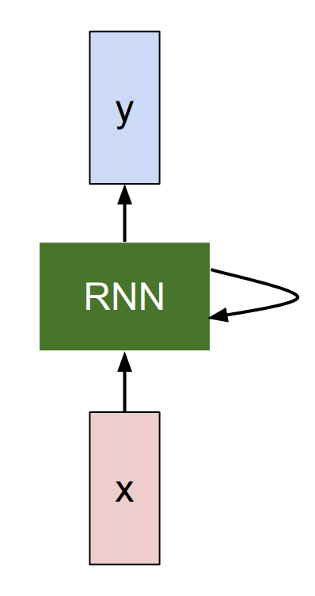
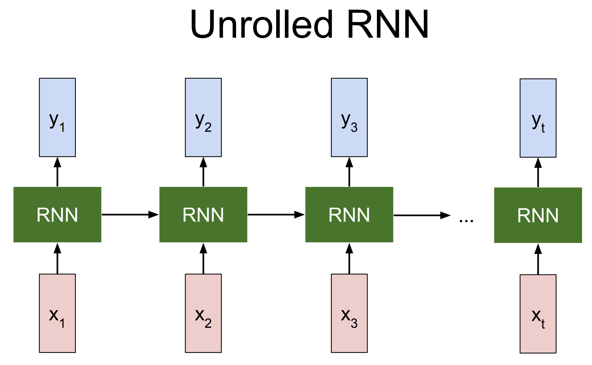
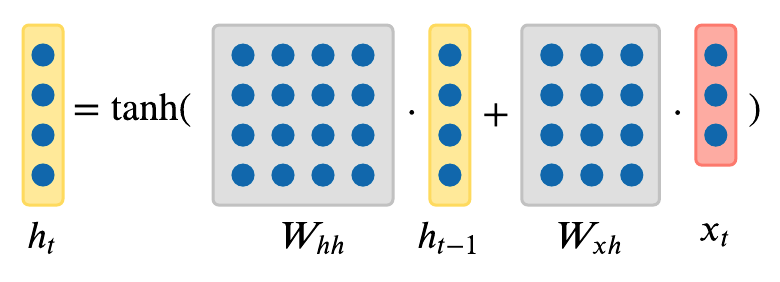

# 순환 신경망(RNN) 
## Part 1: 개요 

## 1장. 왜 RNN이 필요한가?

### 1.1 기존 신경망(CNN/MLP)의 한계

기존 신경망(CNN/MLP)은 입력과 출력의 크기가 고정된 구조를 가집니다:

> **입력 (고정 크기)** $\rightarrow$ **은닉층** $\rightarrow$ **출력 (고정 크기)**

예를 들어:
- **이미지 분류:** $224 \times 224 \times 3$ 이미지(고정) $\rightarrow$ 1000개 클래스(고정)
- **제약:** 입출력 크기가 미리 정해져 있어야 함.

#### 구체적 예시: MLP로 감성 분석을 시도한다면?

- 리뷰 A: "좋아요" ($1$개 단어)
- 리뷰 B: "이 영화 정말 좋아요" ($4$개 단어)
- 리뷰 C: "배우 연기도 좋고 스토리도 탄탄해서 정말 재미있게 봤습니다" ($8$개 단어)

MLP는 입력 크기가 고정이므로, 예를 들어 **최대 5개 단어**로 설정하면:

| 리뷰 | MLP 입력 (5칸 고정) | 문제점 |
|------|---------------------|--------|
| A | `[좋아요, 0, 0, 0, 0]` | 패딩이 너무 많아 정보 희석 |
| B | `[이, 영화, 정말, 좋아요, 0]` | 괜찮아 보이지만... |
| C | `[배우, 연기도, 좋고, 스토리도, 탄탄해서]` |  "재미있게 봤습니다" 잘림! |

> **결론:** 고정 크기 입력은 짧은 문장엔 낭비, 긴 문장엔 정보 손실이 발생합니다.

### 1.2 실세계에서 만나는 가변 길이 문제들

| 문제 유형 | 입력 | 출력 | 예시 |
|----------|------|------|------|
| 이미지 캡셔닝 | 이미지 1장 (고정) | 문장 (가변) | "고양이가 소파에 앉아 있다" |
| 감성 분석 | 문장 (가변) | 긍정/부정 (고정) | "이 영화 최고다" → 긍정 |
| 기계 번역 | 영어 문장 (가변) | 한국어 문장 (가변) | "Hello" → "안녕하세요" |
| 비디오 분류 | 프레임 시퀀스 (가변) | 매 프레임 레이블 (가변) | 달리기, 걷기, 점프... |

> **핵심:** CNN은 입출력 크기가 고정되어 있어, 위와 같은 **가변 길이 시퀀스** 문제를 처리할 수 없습니다.

####  왜 고정 크기가 문제인가?

**예시 1: 감성 분석에서 CNN을 사용하려면?**
- 만약 CNN의 입력이 정확히 100개 단어로 고정되어야 한다면?
  - 문장 A: "이 영화 최고" (4단어) → **96개의 패딩(0)을 추가해야 함**
  - 문장 B: "이 영화는 정말 훌륭하고 최고의 작품이며 감동적이고 모든 것이 완벽하다" (15단어) → 85개 패딩
  - 문장 C: "재미없다" (2단어) → 98개 패딩

→ **문제점:** 의미 있는 정보(단어)는 4%인데 96%는 패딩 → 비효율적

**예시 2: 기계 번역에서의 문제**
- 영어 → 한국어 번역 시
  - "Hello" (1단어) → "안녕하세요" (1단어)
  - "How are you?" (3단어) → "어떻게 지내세요?" (2단어)
  - 같은 의미도 언어마다 길이가 다름 → 고정 크기로는 불가능

####  RNN이 해결하는 방법

**재귀적 구조(Recurrence)** 를 이용하여:
- 시퀀스의 길이와 **무관하게** 동작
- 한 번에 한 단계(타임스텝)씩 처리 → **메모리 효율적**
- 이전 정보를 "기억"하는 **은닉 상태**를 유지

### 1.3 RNN이 제공하는 유연성

> ** 이미지 설명 (types.png):**  
> 5가지 RNN 아키텍처를 도식화한 그림입니다.  
> - 왼쪽부터 **one-to-one**(빨간→초록 하나씩), **one-to-many**(빨간 하나→초록 여러 개), **many-to-one**(빨간 여러 개→초록 하나), **many-to-many(지연)**(빨간 여러 개→초록 여러 개, 인코더-디코더), **many-to-many(동기)**(빨간과 초록이 동시에 진행)  
> - **빨간색 블록** = 입력, **초록색 블록** = 출력, **가운데 파란색 블록** = RNN 은닉 상태

RNN은 다음과 같이 다양한 입출력 구조를 지원합니다:

| 모델 유형 | 설명 | 대표 응용 |
|----------|------|----------|
| **일대일 (One-to-One)** | 고정 입력 → 고정 출력 | 일반 이미지 분류 (vanilla NN) |
| **일대다 (One-to-Many)** | 고정 입력 → 시퀀스 출력 | 이미지 캡셔닝 |
| **다대일 (Many-to-One)** | 시퀀스 입력 → 고정 출력 | 감성 분석, 행동 인식 |
| **다대다 (Many-to-Many) ①** | 시퀀스 입력 → 시퀀스 출력 (지연) | 기계 번역 |
| **다대다 (Many-to-Many) ②** | 시퀀스 입력 → 시퀀스 출력 (동기) | 비디오 프레임 분류 |

####  각 유형의 한국어 데이터 예시

**① 일대다 (One-to-Many) — 이미지 캡셔닝:**
- **입력:** [고양이 사진 텐서]
- **출력:** "고양이" $\rightarrow$ "가" $\rightarrow$ "소파에" $\rightarrow$ "앉아" $\rightarrow$ "있다"

**② 다대일 (Many-to-One) — 감성 분석:**
- **입력:** "이" $\rightarrow$ "영화" $\rightarrow$ "정말" $\rightarrow$ "재미있다"
- **출력:** 긍정 ($1$)

**③ 다대다 (Many-to-Many) — 기계 번역:**
- **입력:** "나" $\rightarrow$ "는" $\rightarrow$ "학생" $\rightarrow$ "이다"
- **출력:** "I" $\rightarrow$ "am" $\rightarrow$ "a" $\rightarrow$ "student"

> **RNN의 핵심 아이디어:** 모든 타임스텝에서의 예측이, 그 이전까지의 **모든 타임스텝의 정보를 반영**합니다.

---

## 2장. RNN의 기본 구조

### 2.1 블랙박스로 이해하는 RNN

RNN을 처음 이해할 때 "블랙박스"로 생각해 봅시다:

- RNN 내부에는 **내부 상태(Internal State)** 가 존재합니다
- 시퀀스가 입력될 때마다 이 내부 상태가 **업데이트** 됩니다
- 이 내부 상태를 **은닉 상태(Hidden State)**, $h$ 로 표기합니다

####  직관적 비유: "기억"을 갖는 상자

RNN을 **기억력이 있는 상자**로 생각해봅시다:

**시간 1초:**
- 입력: "안녕"
- 은닉 상태: $h_0 = \mathbf{0}$ (비어있음)
- [**상자 처리**] $\rightarrow$ 새로운 기억 생성: $h_1$
- 출력: "반가워" (첫 번째 응답)

**시간 2초:**
- 입력: "하세"
- 은닉 상태: 이전의 기억 $h_1$ (**★ 이전 정보 기억**)
- [**상자 처리**] $\rightarrow$ 기억 업데이트: $h_2$
- 출력: 응답 (첫 번째 입력 "안녕"도 고려됨)

**시간 3초:**
- 입력: "요"
- 은닉 상태: $h_2$ (**★ "안녕" + "하세" 정보 포함**)
- [**상자 처리**] $\rightarrow$ $h_3$
- 출력: 응답 (전체 문맥 "안녕하세요" 반영)

**구체적 예시:**
- 일반 신경망: 각 단계마다 기억 없음 → "요"만 보고 응답
- **RNN**: 모든 이전 입력을 기억 → "안녕하세요"의 흐름을 이해

####  은닉 상태가 담는 정보

은닉 상태 $h_t$는:
- 현재까지 본 모든 입력 정보의 **압축된 요약**
- 크기 $n$ (예: $n=3$)의 벡터
- 이 정보를 이용해 다음 예측을 함

### 2.2 RNN 펼치기 (Unrolling)

시간축으로 RNN을 펼쳐보면 위 그림과 같습니다. 각 타임스텝 $t$ 에서:

1. **입력:** 현재 입력 $x_t$ + 이전 은닉 상태 $h_{t-1}$
2. **처리:** 동일한 가중치 $W$ 를 적용하는 함수 $f_W$
3. **출력:** 현재 은닉 상태 $h_t$ (+ 필요시 출력 $y_t$)

> **핵심 포인트:** 모든 타임스텝에서 **동일한 가중치 $W$** 를 공유합니다. 이 때문에 입력 시퀀스 길이에 무관하게 작동할 수 있습니다!

#### 구체적 예시: "hello" 문자열 처리

문자열 "hello"를 문자 단위로 처리하는 예:

**시간 t=0:**
- $h_0 = [0, 0, 0]$ (초기 상태: 영벡터)

**시간 t=1 (입력: "h"):**
- 입력 $x_1$ = "h"
- 은닉 상태 $h_1 = f_W(h_0, x_1)$ = "h"를 처리한 상태

**시간 t=2 (입력: "e"):**
- 입력 $x_2$ = "e"
- 은닉 상태 $h_2 = f_W(h_1, x_2)$ = "h"와 "e" 모두의 정보 포함

**시간 t=3 (입력: "l"):**
- 입력 $x_3$ = "l"
- 은닉 상태 $h_3 = f_W(h_2, x_3)$ = "h", "e", "l" 모두의 정보 포함

... 계속

####  왜 "같은 가중치"를 사용할까?

**일반 신경망 vs RNN:**

- **일반 신경망:** 층 1 가중치 $W_1 \rightarrow$ 층 2 가중치 $W_2 \rightarrow$ 층 3 가중치 $W_3$ (각 층마다 독립)
- **RNN:** 타임스텝 $t=1$ 가중치 $W \rightarrow t=2$ 가중치 $W \rightarrow t=3$ 가중치 $W$ (**동일한 가중치 재사용**)

**장점:**
- 시퀀스 길이와 무관하게 동작
- 파라미터 개수가 적음 (메모리 효율)
- 어떤 길이의 입력도 처리 가능

---

### 2.3 Vanilla RNN이란? (RNN의 기본형)

####  "Vanilla"는 무엇인가?

**"Vanilla"의 의미:**
- 프로그래밍에서: **가장 기본적인, 꾸미지 않은, 순수한 형태**
- 아이스크림: "바닐라 맛" = 기본 맛 (가장 단순한 맛)
- 딥러닝: "Vanilla RNN" = **가장 기본적인 RNN**

#### RNN의 여러 변형들

학자들이 "기울기 소실" 문제를 해결하기 위해 여러 RNN 변형을 만들었습니다:

| 종류 | 설명 | 특징 | 발표 연도 |
|------|------|------|----------|
| **Vanilla RNN** | 가장 기본적인 RNN | 간단함, 하지만 기울기 소실 문제 | 1997 |
| **LSTM** | Long Short-Term Memory | 기울기 소실 문제 해결, 복잡함 | 1997 |
| **GRU** | Gated Recurrent Unit | LSTM보다 간단, 거의 같은 성능 | 2014 |
| **Bidirectional RNN** | 양방향 처리 | 과거와 미래 정보 모두 사용 | 2005 |

####  Vanilla RNN vs LSTM vs GRU 비교

**1. Vanilla RNN (기본형)**
- **수식:** $h_t = \tanh(W_{hh} h_{t-1} + W_{xh} x_t)$
- **특징:** 구조가 단순하고 파라미터가 적어 학습 속도가 빠름.
- **문제점:** **기울기 소실** 문제로 인해 긴 시퀀스 학습에 취약함.

**2. LSTM (정교한 형태)**
- **수식:** (복잡한 게이트 계산 포함)
- **특징:** Cell state와 여러 게이트(입력, 망각, 출력)를 가짐.
- **장점:** 기울기 소실 문제를 해결하여 **긴 의존성(Long-term dependency)** 학습 가능.
- **단점:** 구조가 복잡하고 파라미터가 많음 (Vanilla의 약 4배).

**3. GRU (LSTM의 경량 버전)**
- **수식:** (LSTM과 유사하나 더 간결함)
- **특징:** LSTM의 장점을 유지하면서 구조를 단순화함.
- **장점:** LSTM과 비슷한 성능을 내면서 계산량이 적음.
- **파라미터:** Vanilla의 약 3배 수준.

####  Vanilla RNN?

1. **기초 개념 이해**
   - 은닉 상태, 재귀 구조 등 기본 개념 파악
   - LSTM/GRU는 Vanilla의 기반 위에 만들어짐

2. **역사적 순서**
   - Vanilla RNN (1997) → LSTM (1997) → GRU (2014)
   - 역사적으로 Vanilla가 먼저 나옴

3. **문제 이해**
   - Vanilla의 "기울기 소실" 문제를 먼저 알아야
   - LSTM이 왜 필요한지 이해 가능

4. **코드 간결성**
   - Vanilla: 약 10줄
   - LSTM: 약 50줄
   - 간단한 것부터 학습하는 원칙

---

### 2.4 수식으로 이해하는 RNN

#### 재귀 공식 (Recurrence Formula)

$$\boxed{h_t = f_W(h_{t-1}, x_t)}$$

**의미:** 현재 은닉 상태는 **이전 상태**와 **현재 입력**에만 의존

**기호 설명:**
| 기호 | 의미 | 차원 | 예시 |
|------|------|------|------|
| $h_t$ | 타임스텝 $t$ 에서의 **은닉 상태 벡터** | $\mathbb{R}^n$ | [0.5, -0.3, 0.8] |
| $h_{t-1}$ | 이전 타임스텝의 **은닉 상태 벡터** | $\mathbb{R}^n$ | [0.2, -0.1, 0.5] |
| $x_t$ | 타임스텝 $t$ 에서의 **입력 벡터** | $\mathbb{R}^d$ | [1, 0, 0, 0] (one-hot) |
| $f_W$ | 가중치 $W$ 를 가진 **고정 함수** | - | $\tanh(\cdot)$ |
| $W$ | RNN의 **학습 가능한 가중치** | - | 수정됨 |

#### 핵심 아이디어: Markov 성질

$$h_t \text{는 } h_{t-1} \text{과 } x_t \text{에만 의존}$$

→ 이전의 모든 정보가 $h_{t-1}$에 **압축**되어 있다!

**예시:**

| 타임스텝 | 수식 | 의미 |
|----------|------|------|
| 1 | $h_1 = f_W(h_0, x_1)$ | 입력 1만 본 정보 |
| 2 | $h_2 = f_W(h_1, x_2)$ | 입력 1,2의 정보 ($h_1$에 압축) |
| 3 | $h_3 = f_W(h_2, x_3)$ | 입력 1,2,3의 정보 ($h_2$에 압축) |
| 4 | $h_4 = f_W(h_3, x_4)$ | 입력 1,2,3,4의 정보 ($h_3$에 압축) |

**비유:** 은닉 상태는 "뇌의 기억력" 같은 역할
- 모든 이전 대화 내용을 완벽하게 기억
- 하지만 메모리 제약으로 **중요한 정보만 압축**

### 2.5 Vanilla RNN 상세 수식

가장 기본적인 형태인 **Vanilla RNN**의 은닉 상태 업데이트 수식:

$$\boxed{h_t = \tanh(W_{hh} h_{t-1} + W_{xh} x_t)}$$

**기호 설명:**
| 기호 | 의미 | 차원 |
|------|------|------|
| $W_{hh}$ | **은닉→은닉** 가중치 행렬 | $\mathbb{R}^{n \times n}$ |
| $W_{xh}$ | **입력→은닉** 가중치 행렬 | $\mathbb{R}^{n \times d}$ |
| $\tanh$ | 쌍곡선 탄젠트 활성화 함수, 출력 범위: $(-1, 1)$ | - |

####  계산 과정 - 상세 분석

**단계별 연산:**

| 단계 | 연산 | 차원 | 설명 |
|------|------|------|------|
| 1 | $x_t$ 준비 | $(d, 1)$ | 현재 입력 (원-핫 벡터) |
| 2 | $W_{xh} \cdot x_t$ | $(n, 1)$ | 입력을 은닉 공간으로 변환 |
| 3 | $h_{t-1}$ 준비 | $(n, 1)$ | 이전 은닉 상태 |
| 4 | $W_{hh} \cdot h_{t-1}$ | $(n, 1)$ | 이전 상태를 새 은닉 공간으로 변환 |
| 5 | $W_{xh} x_t + W_{hh} h_{t-1}$ | $(n, 1)$ | **두 정보의 합산** (현재 + 이전) |
| 6 | $\tanh(\cdot)$ 적용 | $(n, 1)$ | **활성화** → $h_t$ 생성 |

####  구체적 수치 예시

**설정:** 
- 입력 크기: $d = 4$ (어휘: h, e, l, o)
- 은닉 크기: $n = 3$

**초기값 (t=1):**
- 입력: $x_1 = [1, 0, 0, 0]^T$ (문자 "h")
- 이전 상태: $h_0 = [0, 0, 0]^T$ (초기화)

**가중치 (학습 후):**
$$W_{xh} = \begin{pmatrix} 0.2 & -0.1 & 0.3 & 0.1 \\ 0.5 & 0.2 & -0.2 & 0.4 \\ -0.3 & 0.4 & 0.1 & -0.2 \end{pmatrix}, \quad
W_{hh} = \begin{pmatrix} 0.1 & 0.2 & -0.1 \\ -0.2 & 0.3 & 0.1 \\ 0.4 & -0.1 & 0.2 \end{pmatrix}$$

**계산:**
$$W_{xh} \cdot x_1 = \begin{pmatrix} 0.2 \\ 0.5 \\ -0.3 \end{pmatrix}, \quad
W_{hh} \cdot h_0 = \begin{pmatrix} 0 \\ 0 \\ 0 \end{pmatrix}$$

$$z_1 = W_{xh} x_1 + W_{hh} h_0 = \begin{pmatrix} 0.2 \\ 0.5 \\ -0.3 \end{pmatrix}$$

$$h_1 = \tanh\begin{pmatrix} 0.2 \\ 0.5 \\ -0.3 \end{pmatrix} = \begin{pmatrix} 0.197 \\ 0.462 \\ -0.291 \end{pmatrix}$$

####  다음 타임스텝 (t=2, 입력 "e")

- 입력: $x_2 = [0, 1, 0, 0]^T$
- 이전 상태: $h_1 = [0.197, 0.462, -0.291]^T$ ← **이전 정보 포함!**

$$z_2 = W_{xh} x_2 + W_{hh} h_1 = \begin{pmatrix} -0.1 \\ 0.2 \\ 0.4 \end{pmatrix} + \begin{pmatrix} 0.069 \\ 0.063 \\ 0.065 \end{pmatrix} = \begin{pmatrix} -0.031 \\ 0.263 \\ 0.465 \end{pmatrix}$$

$$h_2 = \tanh(z_2) = \begin{pmatrix} -0.031 \\ 0.256 \\ 0.433 \end{pmatrix}$$

** 중요:** $h_2$는 "e"뿐만 아니라 $h_1$을 통해 "h"의 정보도 포함!

#### tanh 함수 특성

$$\tanh(z) = \frac{e^z - e^{-z}}{e^z + e^{-z}}$$

- **출력 범위:** $(-1, +1)$ → 활성화된 벡터가 과도하게 커지지 않음
- **미분:** $\tanh'(z) = 1 - \tanh^2(z)$
- **미분 범위:** $(0, 1]$ (최대값 1)
  - $z = 0$일 때: $\tanh'(0) = 1$ (최대 기울기)
  - $z = \pm 2$일 때: $\tanh'(\pm 2) \approx 0.07$ (매우 작음)

**tanh 함수의 포화(Saturation) 현상:**
은닉 상태 $h_t$를 계산할 때 사용되는 $\tanh$ 함수는 입력값 $z$의 절대값이 커질수록 출력값이 $1$ 또는 $-1$로 수렴하며 기울기(미분값)가 급격히 작아집니다. 이 현상을 시각화하면 다음과 같은 특성을 보입니다:
- $z=0$ 부근: 기울기가 $1.0$으로 최대 (학습이 잘 됨)
- $|z| > 2$ 영역: 기울기가 $0.1$ 이하로 감소 (학습 속도 저하)
- $|z| > 3$ 영역: 기울기가 $0.01$ 이하로 소실 (학습 중단 위기)

상세한 수치와 미분값은 아래 표를 참고하세요:

**주요 입력값에 대한 tanh 출력 및 미분값:**

| $z$ | $\tanh(z)$ | $\tanh'(z)$ | 해석 |
|-----|-----------|-------------|------|
| -3.0 | -0.995 | **0.010** | 포화 → 기울기 거의 소실  |
| -2.0 | -0.964 | **0.071** | 포화 근접 |
| -1.0 | -0.762 | 0.420 | 중간 영역 |
| 0.0 | 0.000 | **1.000** | 최대 기울기  |
| 1.0 | 0.762 | 0.420 | 중간 영역 |
| 2.0 | 0.964 | **0.071** | 포화 근접 |
| 3.0 | 0.995 | **0.010** | 포화 → 기울기 거의 소실  |

- **$|z|$가 작을 때:** 기울기가 크다 (학습 잘 됨)
- **$|z|$가 클 때:** 기울기가 거의 0 (학습 안 됨)  **기울기 소실 문제**

### 2.6 출력 생성 수식

은닉 상태 $h_t$ 로부터 출력 $y_t$ 를 생성:

$$\boxed{y_t = W_{hy} h_t}$$

**기호 설명:**
| 기호 | 의미 | 차원 |
|------|------|------|
| $W_{hy}$ | **은닉→출력** 가중치 행렬 | $\mathbb{R}^{k \times n}$ |
| $y_t$ | 타임스텝 $t$ 의 **출력 벡터** (로짓) | $\mathbb{R}^k$ |

####  출력의 의미: "로짓(Logit)"

$y_t$는 **확률이 아님** → 단지 각 클래스의 **상대적 점수**일 뿐

**예시:**
**예시:**
은닉 상태 $h_1 = [0.197, 0.462, -0.291]$ 일 때, 출력 가중치 $W_{hy}$를 곱한 결과:
$$y_1 = W_{hy} \cdot h_1 = [1.0, 2.2, -3.0, 4.1] \quad (\text{로짓값})$$

| 문자 | 로짓 점수 | 의미 |
|------|-----------|------|
| "h" | 1.0 | 보통 (중간) |
| "e" | **2.2** | **높음** (가능성 높음) |
| "l" | -3.0 | 매우 낮음 (거의 불가능) |
| "o" | 4.1 | 가장 높음 (가장 가능성 높음) |

→ **소프트맥스**를 적용하면 확률로 변환됨 (Part 2에서 상세히 다룸)

####  왜 선형 변환만 사용할까?

출력층에서 **활성화 함수를 사용하지 않는** 이유:
- 은닉 상태는 이미 $(-1, 1)$ 범위로 정규화됨
- 출력은 **비정규화된 확률 점수(로짓)**로 남겨두기
- 소프트맥스와 크로스 엔트로피 손실과 결합하여 수치 안정성 향상

---

## 3장. Vanilla RNN 전체 동작 요약

전체 파라미터는 단 **세 개의 가중치 행렬**:

$$W = \{W_{xh},\ W_{hh},\ W_{hy}\}$$

#### 파라미터 수 계산

"hello" 예제 기준 ($d=4, n=3, k=4$):

| 가중치 | 차원 | 파라미터 수 | 역할 |
|--------|------|------------|------|
| $W_{xh}$ | $3 \times 4$ | 12개 | 입력 → 은닉 |
| $W_{hh}$ | $3 \times 3$ | 9개 | 은닉 → 은닉 |
| $W_{hy}$ | $4 \times 3$ | 12개 | 은닉 → 출력 |
| **합계** | | **33개** | 시퀀스 길이 무관 |

비교: 만약 MLP로 길이 100 시퀀스를 처리한다면 → 입력층만 $100 \times 4 \times 3 = 1200$개 필요

### 3.1 순전파(Forward Pass) 과정

$$h_0 = \mathbf{0} \quad \text{(초기화: 영벡터)}$$

$t = 1, 2, \ldots, T$ 에 대해 반복:

$$h_t = \tanh(W_{hh} \cdot h_{t-1} + W_{xh} \cdot x_t) \quad \leftarrow \text{은닉 상태 업데이트}$$

$$y_t = W_{hy} \cdot h_t \quad \leftarrow \text{출력 생성 (로짓)}$$

$$L_t = \text{Loss}(y_t,\ \text{target}_t) \quad \leftarrow \text{손실 계산}$$

$$L_{\text{total}} = \sum_{t=1}^{T} L_t$$

> **핵심 특성:** 동일한 $W$ 가 모든 타임스텝에서 재사용 → 파라미터 효율적, 가변 길이 처리 가능

### 3.2 구체적 예시: "hello" 전체 순전파

**설정:**
- 훈련 데이터: "hello" → 입력-목표 쌍: (h→e), (e→l), (l→l), (l→o)
- $d = 4$, $n = 3$, $k = 4$
- 2.5절의 동일한 가중치 사용

**타임스텝 t=1 (입력: "h" → 목표: "e")**

- $x_1 = [1, 0, 0, 0]$ (one-hot: "h")
- $h_0 = [0, 0, 0]$
- $h_1 = \tanh(W_{hh} \cdot [0,0,0] + W_{xh} \cdot [1,0,0,0]) = \tanh([0,0,0] + [0.2, 0.5, -0.3]) = [0.197, 0.462, -0.291]$
- $y_1 = W_{hy} \cdot h_1$ = [로짓 4개]
- $\text{softmax}(y_1) = [0.15, 0.08, 0.05, 0.72]$ (확률)
- 정답: "e" (인덱스 1) $\rightarrow$ $L_1 = -\log(0.08) = 2.53$

**타임스텝 t=2 (입력: "e" → 목표: "l")**

- $x_2 = [0, 1, 0, 0]$
- $h_1 = [0.197, 0.462, -0.291]$ $\leftarrow$ "h" 정보 포함
- $h_2 = \tanh(W_{hh} \cdot h_1 + W_{xh} \cdot x_2) = [-0.031, 0.256, 0.433]$
- $y_2 = W_{hy} \cdot h_2$ $\rightarrow$ 확률 분포
- 정답: "l" (인덱스 2) $\rightarrow$ $L_2$ 계산

**타임스텝 t=3, t=4도 동일하게 반복**

**최종 손실:**
$$L = L_1 + L_2 + L_3 + L_4 = 2.53 + \cdots$$

> 학습 목표: $L$을 최소화하도록 $W_{xh}, W_{hh}, W_{hy}$를 업데이트

### 3.3 주요 개념 비교

#### RNN vs 일반 신경망

| 특성 | 일반 NN | RNN |
|------|--------|-----|
| **입력 크기** | 고정 | 가변 |
| **출력 크기** | 고정 | 가변 |
| **가중치** | 각 층마다 다름 | 모든 타임스텝에서 동일 |
| **정보 흐름** | 순방향만 | 시간축 방향 |
| **메모리** | 없음 | 은닉 상태로 기억 |
| **파라미터 수** | 입력 길이에 비례 | 입력 길이와 무관 |

#### 순전파 vs 역전파 흐름도

**순전파 (Forward Pass) - 시간 정방향:**
$$h_0 \xrightarrow{W} h_1 \xrightarrow{W} h_2 \xrightarrow{W} h_3 \xrightarrow{W} h_4$$
$$\uparrow \quad \quad \uparrow \quad \quad \uparrow \quad \quad \uparrow$$
$$x_1 \quad \quad x_2 \quad \quad x_3 \quad \quad x_4$$
$$\downarrow \quad \quad \downarrow \quad \quad \downarrow \quad \quad \downarrow$$
$$y_1 \quad \quad y_2 \quad \quad y_3 \quad \quad y_4$$
$$\downarrow \quad \quad \downarrow \quad \quad \downarrow \quad \quad \downarrow$$
$$L_1 \quad \quad L_2 \quad \quad L_3 \quad \quad L_4$$

**전체 손실:** $L = L_1 + L_2 + L_3 + L_4$

**역전파 (BPTT) - 시간 역방향:**
$$\frac{\partial L}{\partial W} \leftarrow h_1 \leftarrow h_2 \leftarrow h_3 \leftarrow h_4$$
(기울기가 미래에서 과거로 전파되며 합산됨)

### 3.4 왜 RNN이 시퀀스 문제에 적합한가?

1. **맥락(Context) 이해**
   - 은닉 상태가 이전 정보를 기억
   - "안녕" + "하세" + "요" → 전체 의미 이해

2. **가변 길이 처리**
   - 시퀀스 길이와 무관하게 동작
   - 짧은 문장도, 긴 문장도 동일 네트워크로 처리

3. **파라미터 효율**
   - 길이 100 시퀀스도 파라미터 33개 (hello 기준)
   - MLP는 입력 길이가 길수록 파라미터 급증

4. **시간적 의존성 모델링**
   - "어제 주식이 올랐다" 정보가 "오늘 주식 예측"에 영향
   - RNN의 은닉 상태가 이런 의존성을 자동 학습

---

## 4장. BPTT(Backpropagation Through Time) - 역전파

### 4.1 시간을 통한 역전파란?

RNN에서의 역전파는 **일반 신경망**과 다릅니다. 시간축을 따라 역으로 계산합니다.

**순전파 (시간 정방향 $\rightarrow$):**
- $x_1(\text{"h"}) \rightarrow h_1 \rightarrow y_1 \rightarrow L_1$
- $x_2(\text{"e"}) \rightarrow h_2 \rightarrow y_2 \rightarrow L_2$
- $x_3(\text{"l"}) \rightarrow h_3 \rightarrow y_3 \rightarrow L_3$
- $x_4(\text{"l"}) \rightarrow h_4 \rightarrow y_4 \rightarrow L_4$
- **합계:** $L = L_1 + L_2 + L_3 + L_4$

**역전파 (시간 역방향 $\leftarrow$):**
- $L_4 \rightarrow \frac{\partial L}{\partial y_4} \rightarrow \frac{\partial L}{\partial h_4} \rightarrow \text{기울기 합산}$
- $L_3 \rightarrow \frac{\partial L}{\partial y_3} \rightarrow \frac{\partial L}{\partial h_3} \rightarrow \text{기울기 합산}$
- $L_2 \rightarrow \frac{\partial L}{\partial y_2} \rightarrow \frac{\partial L}{\partial h_2} \rightarrow \text{기울기 합산}$
- $L_1 \rightarrow \frac{\partial L}{\partial y_1} \rightarrow \frac{\partial L}{\partial h_1} \rightarrow \text{기울기 합산} \rightarrow \frac{\partial L}{\partial W}$

#### 일반 역전파와의 차이

| 구분 | 일반 신경망 | RNN (BPTT) |
|------|-----------|------------|
| 역전파 방향 | 층 방향 (위→아래) | 시간 방향 (미래→과거) |
| 가중치 공유 | 없음 (각 층 독립) | 있음 (동일 W 공유) |
| 기울기 합산 | 각 층 독립 업데이트 | 모든 타임스텝의 기울기 합산 |
| 계산 비용 | 층 수에 비례 | 시퀀스 길이에 비례 |

### 4.2 가중치 업데이트의 핵심

**RNN의 가장 중요한 특징:** 모든 타임스텝에서 **같은 가중치** $W$를 사용!

따라서 전체 손실에 대한 $W$의 기울기는:

$$\frac{\partial L}{\partial W} = \frac{\partial L_1}{\partial W} + \frac{\partial L_2}{\partial W} + \frac{\partial L_3}{\partial W} + \frac{\partial L_4}{\partial W}$$

즉, **모든 타임스텝의 기울기를 합산**해서 가중치를 한 번에 업데이트!

#### "hello" 예제에서의 가중치 업데이트

$$W_{\text{new}} = W_{\text{old}} - \eta \cdot \frac{\partial L}{\partial W}$$

여기서 기울기 $\frac{\partial L}{\partial W}$ 는 각 시점의 기울기 합입니다:
$$\frac{\partial L}{\partial W} = \frac{\partial L_1}{\partial W} + \frac{\partial L_2}{\partial W} + \frac{\partial L_3}{\partial W} + \frac{\partial L_4}{\partial W}$$

**예시 ($\eta = 0.01$):**
- $W_{xh\_new} = W_{xh\_old} - 0.01 \cdot \frac{\partial L}{\partial W_{xh}}$
- $W_{hh\_new} = W_{hh\_old} - 0.01 \cdot \frac{\partial L}{\partial W_{hh}}$
- $W_{hy\_new} = W_{hy\_old} - 0.01 \cdot \frac{\partial L}{\partial W_{hy}}$

### 4.3 체인 룰(Chain Rule)의 연쇄 적용

타임스텝 $t=4$에서의 손실 $L_4$가 $W$에 어떻게 의존하는지 추적해봅시다:
- $L_4$ 는 $y_4$ 에 의존
- $y_4$ 는 $h_4$ 에 의존
- $h_4$ 는 $h_3$ 와 $W$ 에 의존
- $h_3$ 는 $h_2$ 와 $W$ 에 의존
- $h_2$ 는 $h_1$ 와 $W$ 에 의존
- $h_1$ 는 $h_0$ 와 $W$ 에 의존

따라서:
$$\frac{\partial L_4}{\partial W} = \frac{\partial L_4}{\partial y_4} \cdot \frac{\partial y_4}{\partial h_4} \cdot \frac{\partial h_4}{\partial h_3} \cdot \frac{\partial h_3}{\partial h_2} \cdot \frac{\partial h_2}{\partial h_1} \cdot \frac{\partial h_1}{\partial W}$$

**핵심:** 타임스텝이 길어질수록 **곱하는 항이 많아짐** → 이것이 기울기 소실의 원인!

#### "hello" 예제에서의 체인 룰 추적

$L_4$ (문자 "o" 예측 실패) $\rightarrow$ $\frac{\partial L_4}{\partial y_4}$ (출력 오차) $\rightarrow \frac{\partial y_4}{\partial h_4}$ ($W_{hy}$) $\rightarrow \frac{\partial h_4}{\partial h_3}$ ($W_{hh}$) $\rightarrow \frac{\partial h_3}{\partial h_2}$ ($W_{hh}$) $\rightarrow \frac{\partial h_2}{\partial h_1}$ ($W_{hh}$)

**총 기울기:**
$$\frac{\partial L_4}{\partial W} = \frac{\partial L_4}{\partial y_4} \cdot W_{hy} \cdot [\tanh'(z_4) W_{hh}] \cdot [\tanh'(z_3) W_{hh}] \cdot [\tanh'(z_2) W_{hh}]$$
$\Rightarrow$ $W_{hh}$ 가 반복적으로 곱해지며 기울기가 사라지거나(소실) 폭주(폭발)하게 됩니다.

####  구체적 계산

$$\frac{\partial h_t}{\partial h_{t-1}} = \tanh'(\cdot) \cdot W_{hh}$$

여기서 $\tanh'(\cdot) \in (0, 1]$ (최대값이 1)

따라서:
$$\left| \frac{\partial h_t}{\partial h_{t-1}} \right| \leq \sigma_{\max}(W_{hh})$$

여기서 $\sigma_{\max}(W_{hh})$는 $W_{hh}$의 **최대 특이값(singular value)**

### 4.4 기울기 소실 문제 (Vanishing Gradient Problem)

#### 문제: 기울기가 지수적으로 감소

시간이 길어질수록:
$$\left| \frac{\partial L_T}{\partial W} \right| \approx \left( \sigma_{\max}(W_{hh}) \right)^T \times \text{const}$$

만약 $\sigma_{\max}(W_{hh}) < 1$이면:

| 시간 $T$ | 기울기 크기 | 학습 영향 |
|----------|-----------|----------|
| $T=1$ | $0.9^1 = 0.90$ | 정상 학습 |
| $T=10$ | $0.9^{10} \approx 0.35$ | 학습 감소 |
| $T=50$ | $0.9^{50} \approx 0.005$ | 거의 학습 불가 |
| $T=100$ | $0.9^{100} \approx 0.0000027$ | 완전히 소실 |

**결과:** 
- 오래 전 입력 ($t=1$)은 학습에 거의 영향 못 함
- 최근 입력 ($t=99, 100$)만 학습

####  실제 문제점

**문제: 긴 의존성 학습 불가**

**예시: 영화 감상평 분석**
> "이 **영화**는 ... [중간에 100개 단어] ... 정말 **재미없다**"

1. **RNN이 배워야 할 내용:** "이 영화는" (문장의 주체) + "재미없다" (결론) $\Rightarrow$ **부정적 감정**
2. **기울기 소실의 영향:**
   - 처음의 "이 영화는" 정보에 대한 기울기가 거의 0이 됨.
   - 네트워크는 최근 단어인 "재미없다"만 보고 판단하거나, 과거 정보를 아예 무시하게 됨.
   - **예:** "이 영화는 처음에는 재미없었지만 결국 **감동적이었다**" 라는 문장에서 "재미없었" 부분에만 가중치가 쏠려 부정으로 잘못 예측할 수 있음.

####  기울기 폭발(Gradient Explosion)도 있음

반대로 $\sigma_{\max}(W_{hh}) > 1$이면 기울기가 **지수적으로 증가**:
$$\left| \frac{\partial L_T}{\partial W} \right| \approx \left( \sigma_{\max}(W_{hh}) \right)^T \times \text{const} → \infty$$

| 시간 $T$ | 기울기 크기 ($\sigma=1.1$) | 결과 |
|----------|-------------------------|------|
| $T=1$ | $1.1^1 = 1.1$ | 정상 |
| $T=10$ | $1.1^{10} \approx 2.6$ | 약간 큼 |
| $T=50$ | $1.1^{50} \approx 117$ | 불안정 |
| $T=100$ | $1.1^{100} \approx 13,781$ | NaN 발생 |

**결과:**
- 가중치가 불안정하게 업데이트
- 훈련이 발산 → 손실이 NaN이 됨

#### 기울기 소실 vs 기울기 폭발 비교

| 구분 | 기울기 소실 | 기울기 폭발 |
|------|-----------|-----------|
| 조건 | $\sigma_{\max}(W_{hh}) < 1$ | $\sigma_{\max}(W_{hh}) > 1$ |
| 증상 | 기울기 → 0 | 기울기 → 무한대 |
| 학습 영향 | 먼 과거 정보 학습 불가 | 학습 발산, NaN |
| 해결 방법 | LSTM/GRU | 그래디언트 클리핑 |
| 발견 난이도 | 어려움 (조용히 실패) | 쉬움 (NaN 발생) |

### 4.5 해결 방법

1. **그래디언트 클리핑 (Gradient Clipping)**
   - 기울기의 크기가 임계값을 초과하면 잘라냄
   - 구현: `torch.nn.utils.clip_grad_norm_(model.parameters(), max_norm=5)`

2. **LSTM/GRU**
   - 특별한 게이트 구조로 기울기 소실 문제 해결
   - 셀 상태(cell state)를 통해 기울기가 직접 흐를 수 있는 경로 제공

3. **학습률 조정**
   - 학습률이 너무 크면 폭발, 너무 작으면 수렴 안 함
   - Adam 등 적응형 옵티마이저 사용

---

## 5장. Part 1 요약

### 학습한 주요 내용

1. **RNN의 필요성** (1장)
   - 일반 신경망: 고정 크기 입출력 → 가변 길이 시퀀스 처리 불가
   - RNN: 재귀 구조로 가변 길이 시퀀스 처리 가능
   - 5가지 입출력 유형: one-to-one, one-to-many, many-to-one, many-to-many

2. **Vanilla RNN 구조** (2장)
   - 3개 가중치: $W_{xh}$, $W_{hh}$, $W_{hy}$
   - 모든 타임스텝에서 동일 가중치 공유 → 파라미터 효율적
   - 은닉 상태 $h_t$: 이전 모든 입력의 압축된 기억

3. **전체 동작 흐름** (3장)
   - 순전파: 입력 → 은닉 상태 업데이트 → 출력 → 손실 계산
   - 가중치 공유로 시퀀스 길이에 무관한 처리

4. **BPTT와 기울기 문제** (4장)
   - BPTT: 시간 역방향으로 기울기 전파
   - 기울기 소실: $\sigma_{\max}(W_{hh}) < 1$ → 먼 과거 정보 학습 불가
   - 기울기 폭발: $\sigma_{\max}(W_{hh}) > 1$ → NaN 발생

### 핵심 수식 총정리

| 수식 | 의미 | 관련 절 |
|------|------|--------|
| $h_t = \tanh(W_{hh} h_{t-1} + W_{xh} x_t)$ | 은닉 상태 업데이트 | 2.5 |
| $y_t = W_{hy} h_t$ | 출력 생성 (로짓) | 2.6 |
| $L_t = -\log(\text{softmax}(y_t)[\text{정답}])$ | 크로스 엔트로피 손실 | 3.1 |
| $L = \sum_{t=1}^{T} L_t$ | 전체 손실 | 3.1 |
| $\frac{\partial L}{\partial W} = \sum_t \frac{\partial L_t}{\partial W}$ | BPTT 기울기 | 4.2 |

### "hello" 예제로 보는 전체 흐름

**[데이터 준비]**
- \"hello\" $\rightarrow$ 입력-목표 쌍: (h,e), (e,l), (l,l), (l,o)
- 어휘: {h=0, e=1, l=2, o=3}, 원-핫 인코딩

**[모델 설정]**
- 파라미터: $W_{xh}$(3x4) + $W_{hh}$(3x3) + $W_{hy}$(4x3) = 33개
- 은닉 크기: 3

**[순전파]**

| 타임스텝 | 입력 | 은닉 상태 | 출력 | 손실 |
|----------|------|-----------|------|------|
| t=1 | \"h\" | $h_1=[0.197, 0.462, -0.291]$ | $y_1$ | $L_1=2.53$ |
| t=2 | \"e\" | $h_2=[-0.031, 0.256, 0.433]$ | $y_2$ | $L_2$ |
| t=3 | \"l\" | $h_3$ | $y_3$ | $L_3$ |
| t=4 | \"l\" | $h_4$ | $y_4$ | $L_4$ |

$$L_{\text{total}} = L_1 + L_2 + L_3 + L_4$$

**[역전파 (BPTT)]**

$$\frac{\partial L}{\partial W} = \frac{\partial L_1}{\partial W} + \frac{\partial L_2}{\partial W} + \frac{\partial L_3}{\partial W} + \frac{\partial L_4}{\partial W}$$

$$W_{\text{new}} = W_{\text{old}} - \text{lr} \times \frac{\partial L}{\partial W}$$

**[반복]**
- 위 과정을 수천 번 반복 $\rightarrow$ 손실 감소 $\rightarrow$ \"hello\" 패턴 학습 완료

### 핵심 용어 정리

| 용어 | 영문 | 의미 |
|------|------|------|
| 은닉 상태 | Hidden State ($h_t$) | 이전 정보의 압축 요약 벡터 |
| 순전파 | Forward Pass | 입력→은닉→출력 방향 계산 |
| 역전파 | BPTT | 손실→가중치 방향 기울기 계산 |
| 로짓 | Logit ($y_t$) | 소프트맥스 이전의 비정규화 점수 |
| 기울기 소실 | Vanishing Gradient | 긴 시퀀스에서 기울기가 0에 수렴 |
| 기울기 폭발 | Exploding Gradient | 긴 시퀀스에서 기울기가 무한대로 발산 |
| 가중치 공유 | Weight Sharing | 모든 타임스텝에서 동일한 W 사용 |